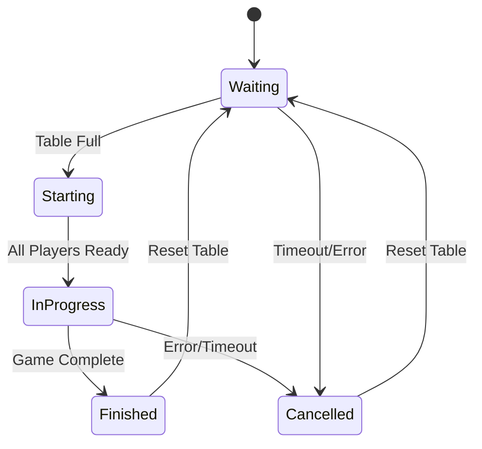
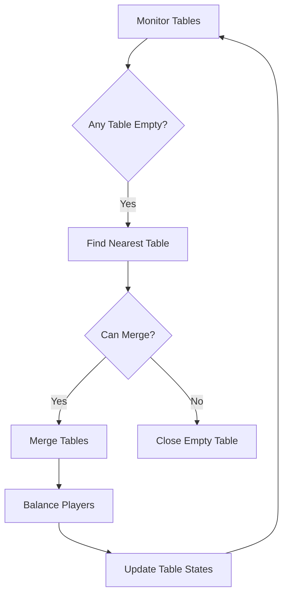
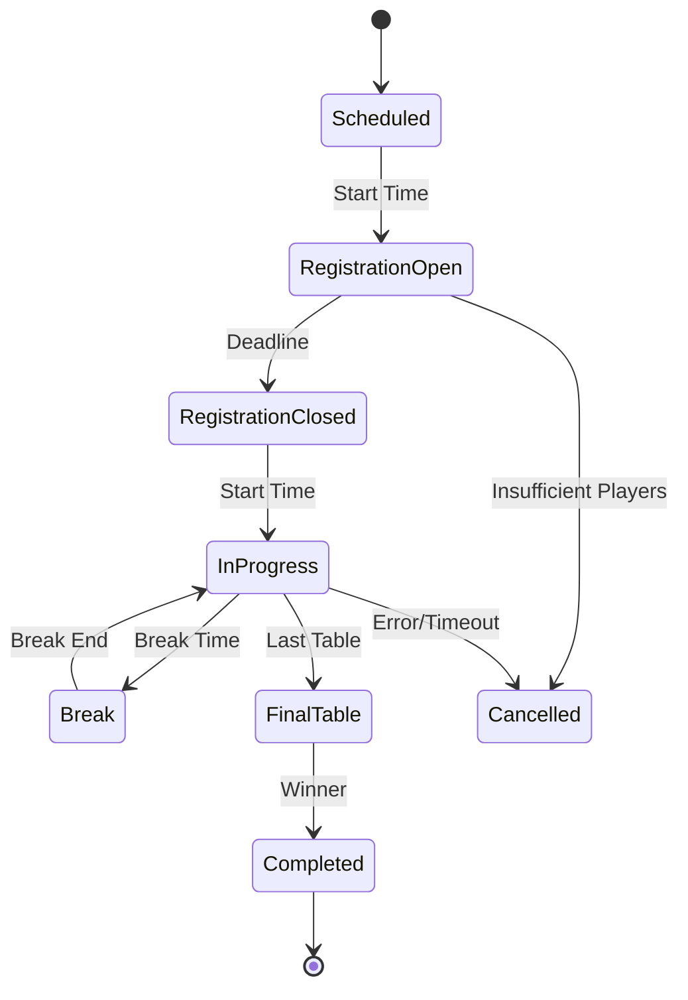
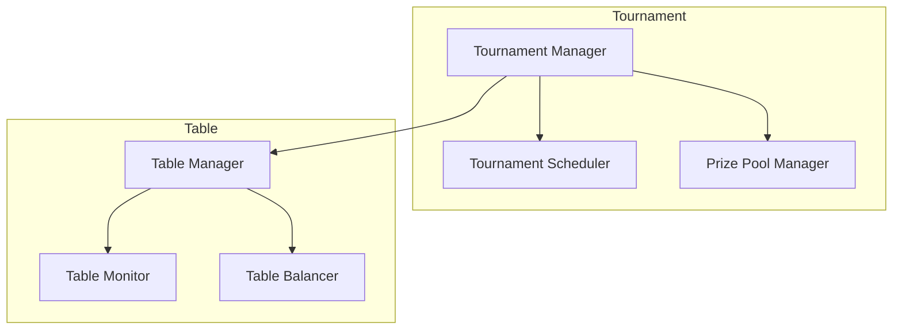
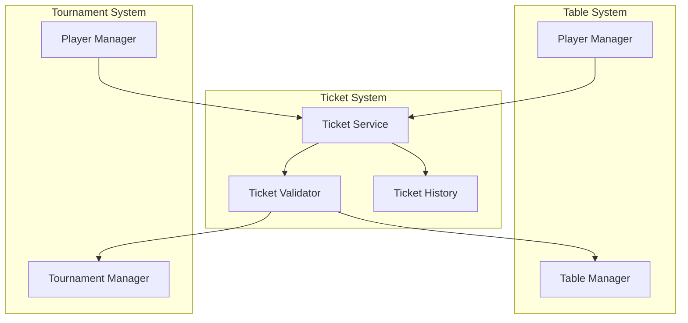

# Table and Tournament Management System

## Table Management System

### Table Configuration

#### Basic Settings
```go
type TableConfig struct {
    ID            string    `json:"id"`
    GameType      string    `json:"gameType"` // "DOMINOES"
    MinPlayers    int       `json:"minPlayers"` // default: 4
    MaxPlayers    int       `json:"maxPlayers"` // default: 8
    BuyInAmount   float64   `json:"buyInAmount"`
    BlindLevel    int       `json:"blindLevel"`
    BlindStructure []BlindLevel `json:"blindStructure"`
    RakePercentage float64  `json:"rakePercentage"` // default: 5%
    TimeBank      int       `json:"timeBank"` // default: 30 seconds
    AutoStart     bool      `json:"autoStart"`
    AllowSpectators bool    `json:"allowSpectators"`
    IsPrivate     bool      `json:"isPrivate"`
    Password      string    `json:"password,omitempty"` // Optional password for private tables
    TicketRequired bool     `json:"ticketRequired"` // Whether a ticket is required to join
    TicketTypes   []string  `json:"ticketTypes"` // Types of tickets accepted
    CreatedAt     time.Time `json:"createdAt"`
    UpdatedAt     time.Time `json:"updatedAt"`
}

type BlindLevel struct {
    Level       int     `json:"level"`
    SmallBlind  float64 `json:"smallBlind"`
    BigBlind    float64 `json:"bigBlind"`
    Ante        float64 `json:"ante"`
    Duration    int     `json:"duration"` // in minutes
    TimeBank    int     `json:"timeBank"` // additional time bank in seconds
}

type GameState struct {
    CurrentRound    int       `json:"currentRound"`
    CurrentPlayer   string    `json:"currentPlayer"`
    LastMove        Move      `json:"lastMove,omitempty"`
    LastMoveTime    time.Time `json:"lastMoveTime"`
    Pot             float64   `json:"pot"`
    CommunityTiles  []Tile    `json:"communityTiles"`
    PlayerStates    map[string]PlayerState `json:"playerStates"`
}

type Move struct {
    PlayerID    string    `json:"playerId"`
    TileID      string    `json:"tileId"`
    Position    Position  `json:"position"`
    Timestamp   time.Time `json:"timestamp"`
}

type Position struct {
    X int `json:"x"`
    Y int `json:"y"`
    Side string `json:"side"` // "left" or "right"
}

type Tile struct {
    ID          string    `json:"id"`
    LeftValue   int       `json:"leftValue"`
    RightValue  int       `json:"rightValue"`
    OwnerID     string    `json:"ownerId,omitempty"`
    IsPlayed    bool      `json:"isPlayed"`
}

type PlayerState struct {
    Hand        []Tile    `json:"hand"`
    Position    int       `json:"position"`
    Stack       float64   `json:"stack"`
    IsActive    bool      `json:"isActive"`
    LastAction  string    `json:"lastAction,omitempty"`
    TimeBank    int       `json:"timeBank"`
}

type Ticket struct {
    ID          string    `json:"id"`
    Type        string    `json:"type"` // "TOURNAMENT", "CASH_GAME", "VIP", "PROMOTION"
    Value       float64   `json:"value"` // Value in tokens or tournament buy-in
    ExpiresAt   time.Time `json:"expiresAt"`
    IsUsed      bool      `json:"isUsed"`
    UsedAt      time.Time `json:"usedAt,omitempty"`
    IssuedBy    string    `json:"issuedBy"` // System, admin, or promotion
    IssuedTo    string    `json:"issuedTo"` // Player ID
    Description string    `json:"description"`
    CreatedAt   time.Time `json:"createdAt"`
    UpdatedAt   time.Time `json:"updatedAt"`
}

type TicketTransaction struct {
    ID          string    `json:"id"`
    TicketID    string    `json:"ticketId"`
    PlayerID    string    `json:"playerId"`
    Action      string    `json:"action"` // "ISSUE", "USE", "EXPIRE", "CANCEL"
    TableID     string    `json:"tableId,omitempty"`
    TournamentID string   `json:"tournamentId,omitempty"`
    Amount      float64   `json:"amount"`
    CreatedAt   time.Time `json:"createdAt"`
}

type TicketService interface {
    // Ticket Management
    IssueTicket(ctx context.Context, ticket Ticket) error
    UseTicket(ctx context.Context, ticketID, playerID, tableID string) error
    CancelTicket(ctx context.Context, ticketID string) error
    GetPlayerTickets(ctx context.Context, playerID string) ([]Ticket, error)
    GetValidTickets(ctx context.Context, playerID string, tableID string) ([]Ticket, error)
    
    // Ticket Validation
    ValidateTicket(ctx context.Context, ticketID string, tableID string) error
    CheckTicketExpiration(ctx context.Context, ticketID string) error
    
    // Ticket Transactions
    GetTicketTransactions(ctx context.Context, ticketID string) ([]TicketTransaction, error)
    GetPlayerTicketHistory(ctx context.Context, playerID string) ([]TicketTransaction, error)
}

type ticketService struct {
    ticketRepo      repository.TicketRepository
    transactionRepo repository.TicketTransactionRepository
    playerRepo      repository.PlayerRepository
    tableRepo       repository.TableRepository
    eventBus        *eventbus.EventBus
}
```

### Table States and Transitions



### Table Operations

```go
type TableService interface {
    // Player Actions
    JoinTable(ctx context.Context, tableID, playerID string) error
    LeaveTable(ctx context.Context, tableID, playerID string) error
    SitOut(ctx context.Context, tableID, playerID string) error
    ReturnToTable(ctx context.Context, tableID, playerID string) error
    
    // Table Management
    CreateTable(ctx context.Context, config TableConfig) (*Table, error)
    CloseTable(ctx context.Context, tableID string) error
    MergeTables(ctx context.Context, sourceID, targetID string) error
    BalanceTables(ctx context.Context, tableIDs []string) error
    
    // Game Control
    StartGame(ctx context.Context, tableID string) error
    PauseGame(ctx context.Context, tableID string) error
    ResumeGame(ctx context.Context, tableID string) error
    EndGame(ctx context.Context, tableID string) error
    
    // Ticket Validation
    ValidatePlayerTicket(ctx context.Context, tableID, playerID string) error
}

type tableService struct {
    tableRepo    repository.TableRepository
    playerRepo   repository.PlayerRepository
    gameRepo     repository.GameRepository
    wsManager    *websocket.Manager
    eventBus     *eventbus.EventBus
}
```

### Table Balancing Algorithm



### Anti-Cheat Measures

1. Move Validation
   - Server-side validation of all moves
   - Time-based move verification
   - Pattern detection for suspicious behavior

2. Connection Management
   - Automatic disconnection handling
   - Time bank system for reconnection
   - Penalty system for frequent disconnects

3. State Synchronization
   - Regular state verification
   - Automatic state recovery
   - Conflict resolution

## Tournament System (Future Release)

### Tournament Types

1. Sit'n Go Tournaments
   - Single table
   - Starts when full
   - Fixed prize pool
   - Blind structure

2. Scheduled Tournaments
   - Multiple tables
   - Fixed start time
   - Guaranteed prize pool
   - Progressive blind structure

3. Satellite Tournaments
   - Qualifier for larger tournaments
   - Multiple entry options
   - Seat-only prizes
   - Special blind structure

### Tournament Configuration

```go
type TournamentConfig struct {
    ID                  string    `json:"id"`
    Type                string    `json:"type"` // "SIT_N_GO", "SCHEDULED", "SATELLITE"
    Name                string    `json:"name"`
    GameType            string    `json:"gameType"` // "DOMINOES"
    StartTime           time.Time `json:"startTime"`
    RegistrationDeadline time.Time `json:"registrationDeadline"`
    MinPlayers          int       `json:"minPlayers"`
    MaxPlayers          int       `json:"maxPlayers"`
    BuyInAmount         float64   `json:"buyInAmount"`
    GuaranteedPrize     float64   `json:"guaranteedPrize"`
    BlindStructure      []BlindLevel `json:"blindStructure"`
    PayoutStructure     []PayoutLevel `json:"payoutStructure"`
    LateRegistration    bool      `json:"lateRegistration"`
    LateRegistrationLevels int    `json:"lateRegistrationLevels"`
    RebuyAllowed        bool      `json:"rebuyAllowed"`
    AddOnAllowed        bool      `json:"addOnAllowed"`
    BreakSchedule       []BreakLevel `json:"breakSchedule"`
    PathEligible        bool      `json:"pathEligible"` // Whether this tournament can be part of a path
    PathBonus           float64   `json:"pathBonus"` // Additional percentage for path players
    CreatedAt           time.Time `json:"createdAt"`
    UpdatedAt           time.Time `json:"updatedAt"`
}

type PayoutLevel struct {
    Position    int       `json:"position"`
    Percentage  float64   `json:"percentage"`
    PrizeType   string    `json:"prizeType"` // "CASH", "TICKET", "MIXED"
    TicketValue float64   `json:"ticketValue,omitempty"` // Value if prize is a ticket
    TicketType  string    `json:"ticketType,omitempty"` // Type of ticket (e.g., "TOURNAMENT", "VIP")
}

type BreakLevel struct {
    Level       int     `json:"level"`
    Duration    int     `json:"duration"` // in minutes
}

type Tournament struct {
    ID            string    `json:"id"`
    Config        TournamentConfig `json:"config"`
    Status        string    `json:"status"`
    CurrentLevel  int       `json:"currentLevel"`
    PrizePool     float64   `json:"prizePool"`
    RegisteredPlayers []string `json:"registeredPlayers"`
    ActiveTables  []string  `json:"activeTables"`
    FinalTable    string    `json:"finalTable,omitempty"`
    Winners       []Winner  `json:"winners,omitempty"`
    CreatedAt     time.Time `json:"createdAt"`
    UpdatedAt     time.Time `json:"updatedAt"`
}

type Winner struct {
    PlayerID    string    `json:"playerId"`
    Position    int       `json:"position"`
    Prize       float64   `json:"prize"`
}
```

### Tournament States



### Tournament Operations

```go
type TournamentService interface {
    // Registration
    RegisterPlayer(ctx context.Context, tournamentID, playerID string) error
    UnregisterPlayer(ctx context.Context, tournamentID, playerID string) error
    
    // Tournament Control
    StartTournament(ctx context.Context, tournamentID string) error
    PauseTournament(ctx context.Context, tournamentID string) error
    ResumeTournament(ctx context.Context, tournamentID string) error
    CancelTournament(ctx context.Context, tournamentID string) error
    
    // Table Management
    CreateTournamentTables(ctx context.Context, tournamentID string) error
    BalanceTournamentTables(ctx context.Context, tournamentID string) error
    MergeTournamentTables(ctx context.Context, tournamentID string) error
    
    // Path Management
    CreatePath(ctx context.Context, path TournamentPath) error
    UpdatePath(ctx context.Context, pathID string, updates TournamentPath) error
    GetPlayerPathProgress(ctx context.Context, playerID, pathID string) (*PlayerPathProgress, error)
    GetEligiblePaths(ctx context.Context, tournamentID string) ([]TournamentPath, error)
    
    // Prize Distribution
    CalculatePrizes(ctx context.Context, tournamentID string) error
    DistributePrizes(ctx context.Context, tournamentID string) error
    DistributePathBonus(ctx context.Context, pathID string) error
}

type tournamentService struct {
    tournamentRepo repository.TournamentRepository
    tableRepo      repository.TableRepository
    playerRepo     repository.PlayerRepository
    eventBus       *eventbus.EventBus
    pathRepo       repository.TournamentPathRepository
    progressRepo   repository.PlayerPathProgressRepository
}
```

### Tournament Features

1. Blind Structure
   - Progressive blind levels
   - Ante implementation
   - Time bank system
   - Break schedule

2. Table Management
   - Automatic table creation
   - Table balancing
   - Final table formation
   - Break management

3. Prize Pool
   - Guaranteed prizes
   - Multiple payout levels
   - Side pool support
   - Satellite seat prizes

4. Player Management
   - Late registration
   - Rebuy system
   - Add-on system
   - Player statistics

### Tournament Monitoring

1. Real-time Statistics
   - Player counts
   - Prize pool updates
   - Table status
   - Blind level progress

2. Performance Metrics
   - Registration rate
   - Completion time
   - Player retention
   - Prize distribution

3. Anti-Cheat Measures
   - Collusion detection
   - Chip dumping prevention
   - Multiple account detection
   - Automated reporting

### Integration with Table System



### Future Enhancements

1. Tournament Series
   - Multiple tournament schedule
   - Points system
   - Leaderboard integration
   - Special events

2. Advanced Features
   - Multi-table tournaments
   - Team tournaments
   - Special formats
   - Custom blind structures

3. Social Features
   - Tournament chat
   - Player profiles
   - Achievement system
   - Social sharing

### Ticket System Features

1. Ticket Types
   - Tournament tickets
   - Cash game tickets
   - VIP access tickets
   - Promotion tickets
   - Special event tickets

2. Ticket Management
   - Automatic ticket validation
   - Ticket expiration handling
   - Ticket usage tracking
   - Ticket transaction history

3. Player Benefits
   - Free tournament entries
   - Cash game buy-ins
   - VIP table access
   - Special event participation

4. Anti-Abuse Measures
   - Ticket validation
   - Usage tracking
   - Expiration enforcement
   - Transaction logging

### Ticket Integration



## Additional Go Idioms and Patterns

### 1. Functional Options Pattern
```go
// Advanced options pattern with validation
type GameOptions struct {
    MinPlayers    int
    MaxPlayers    int
    BuyInAmount   float64
    TimeBank      int
    AutoStart     bool
    Validators    []Validator
}

type GameOption func(*GameOptions) error

func WithMinPlayers(n int) GameOption {
    return func(o *GameOptions) error {
        if n < 2 {
            return errors.New("min players must be at least 2")
        }
        o.MinPlayers = n
        return nil
    }
}

func WithValidators(validators ...Validator) GameOption {
    return func(o *GameOptions) error {
        o.Validators = validators
        return nil
    }
}

func NewGame(opts ...GameOption) (*Game, error) {
    options := &GameOptions{
        MinPlayers: 4,
        MaxPlayers: 8,
        TimeBank:   30,
    }
    
    for _, opt := range opts {
        if err := opt(options); err != nil {
            return nil, fmt.Errorf("invalid option: %w", err)
        }
    }
    
    return &Game{options: options}, nil
}
```

### 2. Builder Pattern
```go
// Builder pattern for complex objects
type TableBuilder struct {
    table *Table
    err   error
}

func NewTableBuilder() *TableBuilder {
    return &TableBuilder{
        table: &Table{},
    }
}

func (b *TableBuilder) WithGameType(gameType string) *TableBuilder {
    if b.err != nil {
        return b
    }
    b.table.GameType = gameType
    return b
}

func (b *TableBuilder) WithPlayers(min, max int) *TableBuilder {
    if b.err != nil {
        return b
    }
    if min < 2 {
        b.err = errors.New("min players must be at least 2")
        return b
    }
    b.table.MinPlayers = min
    b.table.MaxPlayers = max
    return b
}

func (b *TableBuilder) Build() (*Table, error) {
    if b.err != nil {
        return nil, b.err
    }
    return b.table, nil
}
```

### 3. Observer Pattern
```go
// Observer pattern for game events
type GameEvent struct {
    Type      string
    TableID   string
    PlayerID  string
    Data      interface{}
    Timestamp time.Time
}

type GameObserver interface {
    OnGameEvent(event GameEvent)
}

type GameSubject struct {
    observers []GameObserver
    mu        sync.RWMutex
}

func (s *GameSubject) Attach(observer GameObserver) {
    s.mu.Lock()
    defer s.mu.Unlock()
    s.observers = append(s.observers, observer)
}

func (s *GameSubject) Notify(event GameEvent) {
    s.mu.RLock()
    defer s.mu.RUnlock()
    
    for _, observer := range s.observers {
        go observer.OnGameEvent(event)
    }
}
```

### 4. State Pattern
```go
// State pattern for game states
type GameState interface {
    Start(ctx context.Context) error
    Pause(ctx context.Context) error
    Resume(ctx context.Context) error
    End(ctx context.Context) error
}

type WaitingState struct {
    game *Game
}

func (s *WaitingState) Start(ctx context.Context) error {
    if len(s.game.Players) < s.game.MinPlayers {
        return errors.New("not enough players")
    }
    s.game.setState(newInProgressState(s.game))
    return nil
}

type InProgressState struct {
    game *Game
}

func (s *InProgressState) Pause(ctx context.Context) error {
    s.game.setState(newPausedState(s.game))
    return nil
}
```

### 5. Strategy Pattern
```go
// Strategy pattern for move validation
type MoveValidator interface {
    Validate(ctx context.Context, move Move) error
}

type DominoMoveValidator struct {
    rules []MoveRule
}

func (v *DominoMoveValidator) Validate(ctx context.Context, move Move) error {
    for _, rule := range v.rules {
        if err := rule.Validate(ctx, move); err != nil {
            return err
        }
    }
    return nil
}

type MoveRule interface {
    Validate(ctx context.Context, move Move) error
}
```

## Real-World Scenarios

### 1. Distributed Game State Management
```go
type DistributedGameManager struct {
    localState    *GameState
    remoteStates  sync.Map
    coordinator   *Coordinator
    logger        *zap.Logger
}

func (m *DistributedGameManager) SyncState(ctx context.Context) error {
    // Get state from coordinator
    state, err := m.coordinator.GetState(ctx)
    if err != nil {
        return fmt.Errorf("get state: %w", err)
    }

    // Apply state changes
    if err := m.applyState(state); err != nil {
        return fmt.Errorf("apply state: %w", err)
    }

    // Notify local players
    m.notifyPlayers(state)

    return nil
}

func (m *DistributedGameManager) HandleNodeFailure(ctx context.Context, nodeID string) error {
    // Reassign tables from failed node
    tables, err := m.coordinator.GetNodeTables(ctx, nodeID)
    if err != nil {
        return fmt.Errorf("get node tables: %w", err)
    }

    // Redistribute tables
    for _, table := range tables {
        if err := m.reassignTable(ctx, table); err != nil {
            m.logger.Error("failed to reassign table",
                zap.String("table_id", table.ID),
                zap.Error(err))
        }
    }

    return nil
}
```

### 2. Real-time Game Analytics
```go
type GameAnalytics struct {
    metrics    *MetricsCollector
    events     chan GameEvent
    processor  *EventProcessor
    logger     *zap.Logger
}

func (a *GameAnalytics) ProcessEvent(event GameEvent) {
    // Record event metrics
    a.metrics.RecordEvent(event)

    // Update player statistics
    if err := a.updatePlayerStats(event); err != nil {
        a.logger.Error("failed to update player stats",
            zap.String("player_id", event.PlayerID),
            zap.Error(err))
    }

    // Detect patterns
    if pattern := a.detectPattern(event); pattern != nil {
        a.handlePattern(pattern)
    }
}

func (a *GameAnalytics) GenerateReport(ctx context.Context) (*AnalyticsReport, error) {
    report := &AnalyticsReport{
        Timestamp: time.Now(),
    }

    // Collect metrics
    metrics, err := a.metrics.Collect(ctx)
    if err != nil {
        return nil, fmt.Errorf("collect metrics: %w", err)
    }

    // Generate insights
    insights, err := a.generateInsights(ctx, metrics)
    if err != nil {
        return nil, fmt.Errorf("generate insights: %w", err)
    }

    report.Metrics = metrics
    report.Insights = insights

    return report, nil
}
```

### 3. Anti-Cheat System
```go
type AntiCheatSystem struct {
    validators    []CheatValidator
    detectors     []CheatDetector
    logger        *zap.Logger
    eventBus      *eventbus.EventBus
}

func (s *AntiCheatSystem) ValidateMove(ctx context.Context, move Move) error {
    // Validate move legality
    for _, validator := range s.validators {
        if err := validator.Validate(ctx, move); err != nil {
            return fmt.Errorf("invalid move: %w", err)
        }
    }

    // Check for suspicious patterns
    for _, detector := range s.detectors {
        if suspicious := detector.Detect(ctx, move); suspicious {
            s.handleSuspiciousActivity(ctx, move)
        }
    }

    return nil
}

func (s *AntiCheatSystem) handleSuspiciousActivity(ctx context.Context, move Move) {
    // Log suspicious activity
    s.logger.Warn("suspicious activity detected",
        zap.String("player_id", move.PlayerID),
        zap.String("move_id", move.ID))

    // Notify administrators
    s.eventBus.Publish(CheatEvent{
        Type:     "SUSPICIOUS_ACTIVITY",
        PlayerID: move.PlayerID,
        Move:     move,
        Timestamp: time.Now(),
    })
}
```

### 4. Tournament Scheduling System
```go
type TournamentScheduler struct {
    tournaments sync.Map
    scheduler   *time.Timer
    logger      *zap.Logger
    eventBus    *eventbus.EventBus
}

func (s *TournamentScheduler) ScheduleTournament(ctx context.Context, config TournamentConfig) error {
    tournament := NewTournament(config)
    
    // Validate tournament configuration
    if err := s.validateConfig(config); err != nil {
        return fmt.Errorf("invalid config: %w", err)
    }

    // Store tournament
    s.tournaments.Store(tournament.ID, tournament)
    
    // Schedule start
    duration := time.Until(config.StartTime)
    s.scheduler.Reset(duration)
    
    // Start monitoring
    go s.monitorTournament(ctx, tournament.ID)
    
    return nil
}

func (s *TournamentScheduler) monitorTournament(ctx context.Context, tournamentID string) {
    ticker := time.NewTicker(1 * time.Minute)
    defer ticker.Stop()

    for {
        select {
        case <-ctx.Done():
            return
        case <-ticker.C:
            if err := s.checkTournamentStatus(ctx, tournamentID); err != nil {
                s.logger.Error("tournament check failed",
                    zap.String("tournament_id", tournamentID),
                    zap.Error(err))
            }
        }
    }
}
```

### 5. Player Session Management
```go
type SessionManager struct {
    sessions    sync.Map
    auth        *AuthService
    logger      *zap.Logger
}

func (m *SessionManager) CreateSession(ctx context.Context, playerID string) (*Session, error) {
    // Generate session token
    token, err := m.auth.GenerateToken(playerID)
    if err != nil {
        return nil, fmt.Errorf("generate token: %w", err)
    }

    // Create session
    session := &Session{
        ID:        uuid.New().String(),
        PlayerID:  playerID,
        Token:     token,
        CreatedAt: time.Now(),
        ExpiresAt: time.Now().Add(24 * time.Hour),
    }

    // Store session
    m.sessions.Store(session.ID, session)

    // Start session monitoring
    go m.monitorSession(ctx, session.ID)

    return session, nil
}

func (m *SessionManager) monitorSession(ctx context.Context, sessionID string) {
    ticker := time.NewTicker(5 * time.Minute)
    defer ticker.Stop()

    for {
        select {
        case <-ctx.Done():
            return
        case <-ticker.C:
            if err := m.checkSessionStatus(ctx, sessionID); err != nil {
                m.logger.Error("session check failed",
                    zap.String("session_id", sessionID),
                    zap.Error(err))
            }
        }
    }
}
```

## Go-Specific Patterns and Best Practices

### Go Idioms and Best Practices

#### 1. Interface Design
```go
// Prefer small interfaces
type Validator interface {
    Validate(ctx context.Context, data interface{}) error
}

// Interface segregation
type TableValidator interface {
    ValidateTable(ctx context.Context, table *Table) error
    ValidatePlayer(ctx context.Context, player *Player) error
}

// Interface composition
type GameValidator interface {
    TableValidator
    MoveValidator
}

// Interface naming convention
type Stringer interface {
    String() string
}
```

#### 2. Error Handling Patterns
```go
// Sentinel errors
var (
    ErrTableNotFound = errors.New("table not found")
    ErrInvalidMove   = errors.New("invalid move")
    ErrGameInProgress = errors.New("game in progress")
)

// Error wrapping with custom types
type ValidationError struct {
    Field   string
    Message string
    Err     error
}

func (e *ValidationError) Unwrap() error {
    return e.Err
}

// Error handling with context
func (s *tableService) ValidateMove(ctx context.Context, move Move) error {
    if err := s.validateMoveRules(ctx, move); err != nil {
        return fmt.Errorf("invalid move: %w", err)
    }
    return nil
}
```

#### 3. Context Usage Patterns
```go
// Context with timeout and cancellation
func (s *tableService) ProcessGameRound(ctx context.Context, tableID string) error {
    ctx, cancel := context.WithTimeout(ctx, 30*time.Second)
    defer cancel()

    // Use context for cancellation
    done := make(chan error)
    go func() {
        done <- s.processRound(ctx, tableID)
    }()

    select {
    case err := <-done:
        return err
    case <-ctx.Done():
        return ctx.Err()
    }
}

// Context with request ID
type requestIDKey struct{}
func WithRequestID(ctx context.Context, id string) context.Context {
    return context.WithValue(ctx, requestIDKey{}, id)
}
```

#### 4. Concurrency Patterns
```go
// Mutex with defer
type SafeTable struct {
    mu    sync.RWMutex
    table *Table
}

func (st *SafeTable) Update(fn func(*Table) error) error {
    st.mu.Lock()
    defer st.mu.Unlock()
    return fn(st.table)
}

// Atomic operations
type GameState struct {
    activePlayers int32
    currentRound  int32
}

func (gs *GameState) AddPlayer() {
    atomic.AddInt32(&gs.activePlayers, 1)
}

// Channel patterns
type GameEvent struct {
    Type      string
    TableID   string
    PlayerID  string
    Timestamp time.Time
}

func (s *tableService) ProcessEvents(ctx context.Context) {
    events := make(chan GameEvent, 100)
    defer close(events)

    // Fan-out pattern
    for i := 0; i < 5; i++ {
        go s.eventWorker(ctx, events)
    }
}
```

#### 5. Resource Management
```go
// Resource cleanup with defer
type GameSession struct {
    conn    *websocket.Conn
    timer   *time.Timer
    cleanup func()
}

func NewGameSession(conn *websocket.Conn) *GameSession {
    session := &GameSession{
        conn:  conn,
        timer: time.NewTimer(30 * time.Second),
    }
    
    session.cleanup = func() {
        session.timer.Stop()
        session.conn.Close()
    }
    
    return session
}

// Resource pooling
type ConnectionPool struct {
    pool chan *websocket.Conn
}

func NewConnectionPool(size int) *ConnectionPool {
    return &ConnectionPool{
        pool: make(chan *websocket.Conn, size),
    }
}
```

### Real-World Examples

#### 1. WebSocket Connection Management
```go
type WebSocketManager struct {
    connections sync.Map
    upgrader    websocket.Upgrader
    logger      *zap.Logger
}

func (m *WebSocketManager) HandleConnection(w http.ResponseWriter, r *http.Request) {
    conn, err := m.upgrader.Upgrade(w, r, nil)
    if err != nil {
        m.logger.Error("websocket upgrade failed", zap.Error(err))
        return
    }

    session := NewGameSession(conn)
    defer session.cleanup()

    m.connections.Store(session.ID(), session)
    defer m.connections.Delete(session.ID())

    for {
        message, err := conn.ReadMessage()
        if err != nil {
            if websocket.IsUnexpectedCloseError(err) {
                m.logger.Error("websocket read error", zap.Error(err))
            }
            return
        }

        if err := m.handleMessage(session, message); err != nil {
            m.logger.Error("message handling failed", zap.Error(err))
        }
    }
}
```

#### 2. Game State Management
```go
type GameManager struct {
    state     *GameState
    mu        sync.RWMutex
    eventBus  *eventbus.EventBus
    logger    *zap.Logger
}

func (gm *GameManager) ProcessMove(ctx context.Context, move Move) error {
    gm.mu.Lock()
    defer gm.mu.Unlock()

    // Validate move
    if err := gm.validateMove(move); err != nil {
        return fmt.Errorf("invalid move: %w", err)
    }

    // Update game state
    if err := gm.updateState(move); err != nil {
        return fmt.Errorf("state update failed: %w", err)
    }

    // Notify players
    gm.eventBus.Publish(GameEvent{
        Type:     "MOVE_MADE",
        TableID:  move.TableID,
        PlayerID: move.PlayerID,
        Data:     move,
    })

    return nil
}
```

#### 3. Tournament Management
```go
type TournamentManager struct {
    tournaments sync.Map
    scheduler   *time.Timer
    logger      *zap.Logger
}

func (tm *TournamentManager) ScheduleTournament(ctx context.Context, config TournamentConfig) error {
    tournament := NewTournament(config)
    
    // Store tournament
    tm.tournaments.Store(tournament.ID, tournament)
    
    // Schedule start
    duration := time.Until(config.StartTime)
    tm.scheduler.Reset(duration)
    
    go func() {
        <-tm.scheduler.C
        if err := tm.startTournament(ctx, tournament.ID); err != nil {
            tm.logger.Error("tournament start failed", 
                zap.String("tournament_id", tournament.ID),
                zap.Error(err))
        }
    }()
    
    return nil
}
```

#### 4. Rate Limiting and Throttling
```go
type RateLimiter struct {
    limits    map[string]*rate.Limiter
    mu        sync.RWMutex
    defaultRL *rate.Limiter
}

func (rl *RateLimiter) Allow(key string) bool {
    rl.mu.RLock()
    limiter, exists := rl.limits[key]
    rl.mu.RUnlock()

    if !exists {
        rl.mu.Lock()
        limiter = rate.NewLimiter(rate.Every(time.Second), 10)
        rl.limits[key] = limiter
        rl.mu.Unlock()
    }

    return limiter.Allow()
}

// Usage in middleware
func RateLimitMiddleware(rl *RateLimiter) gin.HandlerFunc {
    return func(c *gin.Context) {
        key := c.ClientIP()
        if !rl.Allow(key) {
            c.AbortWithStatusJSON(http.StatusTooManyRequests, gin.H{
                "error": "rate limit exceeded",
            })
            return
        }
        c.Next()
    }
}
```

#### 5. Metrics Collection
```go
type MetricsCollector struct {
    registry *prometheus.Registry
    metrics  map[string]prometheus.Collector
}

func (mc *MetricsCollector) RecordGameMetrics(tableID string, duration time.Duration) {
    gameDuration.WithLabelValues(tableID).Observe(duration.Seconds())
    activeGames.Inc()
}

func (mc *MetricsCollector) RecordPlayerMetrics(playerID string, action string) {
    playerActions.WithLabelValues(playerID, action).Inc()
}

// Usage in game logic
func (s *tableService) EndGame(ctx context.Context, tableID string) error {
    start := time.Now()
    defer func() {
        duration := time.Since(start)
        s.metrics.RecordGameMetrics(tableID, duration)
    }()

    // Game end logic
    return nil
}
```

#### 6. Configuration Management
```go
type Config struct {
    Server   ServerConfig   `yaml:"server"`
    Database DatabaseConfig `yaml:"database"`
    Game     GameConfig     `yaml:"game"`
}

func LoadConfig(path string) (*Config, error) {
    data, err := os.ReadFile(path)
    if err != nil {
        return nil, fmt.Errorf("read config: %w", err)
    }

    var config Config
    if err := yaml.Unmarshal(data, &config); err != nil {
        return nil, fmt.Errorf("parse config: %w", err)
    }

    return &config, nil
}

// Usage in application
func main() {
    config, err := LoadConfig("config.yaml")
    if err != nil {
        log.Fatalf("Failed to load config: %v", err)
    }

    app := NewApplication(config)
    if err := app.Run(); err != nil {
        log.Fatalf("Application error: %v", err)
    }
}
```

### Error Handling

```go
// Custom error types for better error handling
type TableError struct {
    Code    string
    Message string
    Err     error
}

func (e *TableError) Error() string {
    if e.Err != nil {
        return fmt.Sprintf("%s: %s (%v)", e.Code, e.Message, e.Err)
    }
    return fmt.Sprintf("%s: %s", e.Code, e.Message)
}

// Error wrapping with context
func (s *tableService) JoinTable(ctx context.Context, tableID, playerID string) error {
    table, err := s.tableRepo.Get(ctx, tableID)
    if err != nil {
        return &TableError{
            Code:    "TABLE_NOT_FOUND",
            Message: "Table not found",
            Err:     err,
        }
    }
    // ... rest of the code
}
```

### Context Usage

```go
// Context with timeout for operations
func (s *tableService) StartGame(ctx context.Context, tableID string) error {
    ctx, cancel := context.WithTimeout(ctx, 5*time.Second)
    defer cancel()
    
    // Use context for cancellation
    select {
    case <-ctx.Done():
        return ctx.Err()
    default:
        // Game start logic
    }
}

// Context with values for request-scoped data
type contextKey string
const (
    userIDKey contextKey = "userID"
    tableIDKey contextKey = "tableID"
)

func WithUserID(ctx context.Context, userID string) context.Context {
    return context.WithValue(ctx, userIDKey, userID)
}
```

### Interface Segregation

```go
// Break down large interfaces into smaller ones
type TableReader interface {
    Get(ctx context.Context, id string) (*Table, error)
    List(ctx context.Context, filter TableFilter) ([]Table, error)
}

type TableWriter interface {
    Create(ctx context.Context, table *Table) error
    Update(ctx context.Context, table *Table) error
    Delete(ctx context.Context, id string) error
}

type TableRepository interface {
    TableReader
    TableWriter
}
```

### Dependency Injection

```go
// Constructor injection
type tableService struct {
    tableRepo    TableRepository
    playerRepo   PlayerRepository
    gameRepo     GameRepository
    wsManager    *websocket.Manager
    eventBus     *eventbus.EventBus
}

func NewTableService(
    tableRepo TableRepository,
    playerRepo PlayerRepository,
    gameRepo GameRepository,
    wsManager *websocket.Manager,
    eventBus *eventbus.EventBus,
) *tableService {
    return &tableService{
        tableRepo:    tableRepo,
        playerRepo:   playerRepo,
        gameRepo:     gameRepo,
        wsManager:    wsManager,
        eventBus:     eventBus,
    }
}
```

### Middleware Pattern

```go
// Middleware for logging, metrics, and error handling
type Middleware func(TableService) TableService

func LoggingMiddleware(logger *zap.Logger) Middleware {
    return func(next TableService) TableService {
        return &loggingService{
            next:   next,
            logger: logger,
        }
    }
}

type loggingService struct {
    next   TableService
    logger *zap.Logger
}

func (s *loggingService) JoinTable(ctx context.Context, tableID, playerID string) error {
    start := time.Now()
    err := s.next.JoinTable(ctx, tableID, playerID)
    s.logger.Info("join table",
        zap.String("table_id", tableID),
        zap.String("player_id", playerID),
        zap.Duration("duration", time.Since(start)),
        zap.Error(err),
    )
    return err
}
```

### Options Pattern

```go
// Options for flexible configuration
type TableOptions struct {
    MinPlayers    int
    MaxPlayers    int
    BuyInAmount   float64
    TimeBank      int
    AutoStart     bool
}

type TableOption func(*TableOptions)

func WithMinPlayers(n int) TableOption {
    return func(o *TableOptions) {
        o.MinPlayers = n
    }
}

func NewTable(opts ...TableOption) *Table {
    options := &TableOptions{
        MinPlayers: 4,
        MaxPlayers: 8,
        TimeBank:   30,
    }
    
    for _, opt := range opts {
        opt(options)
    }
    
    return &Table{
        MinPlayers: options.MinPlayers,
        MaxPlayers: options.MaxPlayers,
        TimeBank:   options.TimeBank,
    }
}
```

### Worker Pool Pattern

```go
// Worker pool for handling game events
type GameEventWorker struct {
    workers  int
    jobs     chan GameEvent
    handler  func(GameEvent) error
    wg       sync.WaitGroup
}

func NewGameEventWorker(workers int, handler func(GameEvent) error) *GameEventWorker {
    return &GameEventWorker{
        workers: workers,
        jobs:    make(chan GameEvent, workers*2),
        handler: handler,
    }
}

func (w *GameEventWorker) Start(ctx context.Context) {
    for i := 0; i < w.workers; i++ {
        w.wg.Add(1)
        go func() {
            defer w.wg.Done()
            for {
                select {
                case <-ctx.Done():
                    return
                case job := <-w.jobs:
                    if err := w.handler(job); err != nil {
                        // Handle error
                    }
                }
            }
        }()
    }
}
```

### Rate Limiting

```go
// Rate limiter for API endpoints
type RateLimiter struct {
    limiter *rate.Limiter
}

func NewRateLimiter(r rate.Limit, b int) *RateLimiter {
    return &RateLimiter{
        limiter: rate.NewLimiter(r, b),
    }
}

func (rl *RateLimiter) Allow() bool {
    return rl.limiter.Allow()
}

// Usage in middleware
func RateLimitMiddleware(rl *RateLimiter) gin.HandlerFunc {
    return func(c *gin.Context) {
        if !rl.Allow() {
            c.AbortWithStatusJSON(http.StatusTooManyRequests, gin.H{
                "error": "rate limit exceeded",
            })
            return
        }
        c.Next()
    }
}
```

### Circuit Breaker

```go
// Circuit breaker for external service calls
type CircuitBreaker struct {
    failures  int32
    threshold int32
    timeout   time.Duration
    state     int32 // 0: closed, 1: open, 2: half-open
    mu        sync.RWMutex
}

func (cb *CircuitBreaker) Execute(fn func() error) error {
    if !cb.Allow() {
        return errors.New("circuit breaker is open")
    }
    
    err := fn()
    if err != nil {
        cb.RecordFailure()
        return err
    }
    
    cb.RecordSuccess()
    return nil
}
```

### Metrics and Monitoring

```go
// Prometheus metrics
var (
    activeTables = prometheus.NewGauge(prometheus.GaugeOpts{
        Name: "tablium_active_tables",
        Help: "Number of active tables",
    })
    
    playerCount = prometheus.NewGaugeVec(prometheus.GaugeOpts{
        Name: "tablium_players_per_table",
        Help: "Number of players per table",
    }, []string{"table_id"})
    
    gameDuration = prometheus.NewHistogram(prometheus.HistogramOpts{
        Name:    "tablium_game_duration_seconds",
        Help:    "Duration of games in seconds",
        Buckets: prometheus.DefBuckets,
    })
)
```

### Testing Patterns

```go
// Table tests with subtests
func TestTableService_JoinTable(t *testing.T) {
    tests := []struct {
        name    string
        tableID string
        playerID string
        wantErr bool
    }{
        {
            name:     "valid join",
            tableID:  "table1",
            playerID: "player1",
            wantErr:  false,
        },
        {
            name:     "table full",
            tableID:  "table2",
            playerID: "player1",
            wantErr:  true,
        },
    }
    
    for _, tt := range tests {
        t.Run(tt.name, func(t *testing.T) {
            // Test implementation
        })
    }
}

// Mock implementations
type mockTableRepo struct {
    mock.Mock
}

func (m *mockTableRepo) Get(ctx context.Context, id string) (*Table, error) {
    args := m.Called(ctx, id)
    if args.Get(0) == nil {
        return nil, args.Error(1)
    }
    return args.Get(0).(*Table), args.Error(1)
}
```

### Graceful Shutdown

```go
// Graceful shutdown for the application
func (s *Server) Shutdown(ctx context.Context) error {
    // Stop accepting new connections
    if err := s.httpServer.Shutdown(ctx); err != nil {
        return fmt.Errorf("http server shutdown: %w", err)
    }
    
    // Close all active tables
    if err := s.tableService.CloseAllTables(ctx); err != nil {
        return fmt.Errorf("close tables: %w", err)
    }
    
    // Wait for all goroutines to finish
    if err := s.waitGroup.WaitWithTimeout(ctx, 30*time.Second); err != nil {
        return fmt.Errorf("wait for goroutines: %w", err)
    }
    
    return nil
}
```

### Extended Ticket Types and Rewards

```go
// Extended ticket types
const (
    // Tournament Tickets
    TicketTypeTournament     = "TOURNAMENT"      // Standard tournament entry
    TicketTypeSatellite      = "SATELLITE"       // Satellite tournament entry
    TicketTypeFreeroll       = "FREEROLL"        // Freeroll tournament entry
    TicketTypeVIPTournament  = "VIP_TOURNAMENT"  // VIP tournament entry
    
    // Cash Game Tickets
    TicketTypeCashGame       = "CASH_GAME"       // Standard cash game buy-in
    TicketTypeVIPCashGame    = "VIP_CASH_GAME"   // VIP cash game buy-in
    TicketTypeHighStakes     = "HIGH_STAKES"     // High stakes cash game
    
    // Special Access Tickets
    TicketTypeVIP            = "VIP"             // VIP table access
    TicketTypePrivateTable   = "PRIVATE_TABLE"   // Private table access
    TicketTypeExclusiveEvent = "EXCLUSIVE_EVENT" // Exclusive event access
    
    // Achievement Tickets
    TicketTypeAchievement    = "ACHIEVEMENT"     // Achievement rewards
    TicketTypeMilestone      = "MILESTONE"       // Milestone rewards
    TicketTypeSkillLevel     = "SKILL_LEVEL"     // Skill level rewards
    
    // Loyalty Tickets
    TicketTypeLoyalty        = "LOYALTY"         // Loyalty program points
    TicketTypeVIPStatus      = "VIP_STATUS"      // VIP status points
    TicketTypeRankPoints     = "RANK_POINTS"     // Ranking points
    
    // Special Event Tickets
    TicketTypeSpecialEvent   = "SPECIAL_EVENT"   // Special event entry
    TicketTypeHolidayEvent   = "HOLIDAY_EVENT"   // Holiday event entry
    TicketTypeSeasonalEvent  = "SEASONAL_EVENT"  // Seasonal event entry
    
    // Reward Tickets
    TicketTypeReward         = "REWARD"          // General rewards
    TicketTypeBonus          = "BONUS"           // Bonus rewards
    TicketTypeCompensation   = "COMPENSATION"    // Compensation rewards
)

// Extended prize combinations
var prizeCombinations = map[string]PrizeCombination{
    "GRAND_CHAMPION": {
        Type:       "MULTIPLE",
        CashAmount: 5000,
        Tickets: []Ticket{
            {
                Type:        TicketTypeVIPTournament,
                Value:       2000,
                Description: "VIP tournament entry",
            },
            {
                Type:        TicketTypeHighStakes,
                Value:       1500,
                Description: "High stakes cash game entry",
            },
            {
                Type:        TicketTypeExclusiveEvent,
                Value:       1000,
                Description: "Exclusive event access",
            },
            {
                Type:        TicketTypeVIPStatus,
                Value:       500,
                Description: "VIP status points",
            },
        },
        Description: "Grand Champion prize package",
    },
    "TOURNAMENT_MASTER": {
        Type:       "MULTIPLE",
        CashAmount: 3000,
        Tickets: []Ticket{
            {
                Type:        TicketTypeSatellite,
                Value:       1500,
                Description: "Major tournament satellite entry",
            },
            {
                Type:        TicketTypeVIP,
                Value:       800,
                Description: "VIP table access",
            },
            {
                Type:        TicketTypeAchievement,
                Value:       500,
                Description: "Achievement reward",
            },
            {
                Type:        TicketTypeLoyalty,
                Value:       300,
                Description: "Loyalty points",
            },
        },
        Description: "Tournament Master prize package",
    },
    "CASH_GAME_PRO": {
        Type:       "MULTIPLE",
        CashAmount: 2000,
        Tickets: []Ticket{
            {
                Type:        TicketTypeHighStakes,
                Value:       1000,
                Description: "High stakes cash game entry",
            },
            {
                Type:        TicketTypeVIPCashGame,
                Value:       600,
                Description: "VIP cash game access",
            },
            {
                Type:        TicketTypePrivateTable,
                Value:       400,
                Description: "Private table access",
            },
        },
        Description: "Cash Game Pro prize package",
    },
    "ACHIEVEMENT_MASTER": {
        Type:       "MULTIPLE",
        CashAmount: 1500,
        Tickets: []Ticket{
            {
                Type:        TicketTypeAchievement,
                Value:       800,
                Description: "Achievement reward",
            },
            {
                Type:        TicketTypeMilestone,
                Value:       500,
                Description: "Milestone reward",
            },
            {
                Type:        TicketTypeSkillLevel,
                Value:       300,
                Description: "Skill level reward",
            },
        },
        Description: "Achievement Master prize package",
    },
    "SEASONAL_CHAMPION": {
        Type:       "MULTIPLE",
        CashAmount: 2500,
        Tickets: []Ticket{
            {
                Type:        TicketTypeSeasonalEvent,
                Value:       1200,
                Description: "Seasonal event entry",
            },
            {
                Type:        TicketTypeVIP,
                Value:       800,
                Description: "VIP access",
            },
            {
                Type:        TicketTypeLoyalty,
                Value:       500,
                Description: "Loyalty points",
            },
        },
        Description: "Seasonal Champion prize package",
    },
}
```

### Additional Tournament Series Types

```go
// Additional tournament series configurations
var additionalTournamentSeries = map[string]TournamentPath{
    "SKILL_MASTERY_SERIES": {
        ID:          "path_006",
        Name:        "Skill Mastery Series",
        Description: "Progressive skill-based tournament series",
        Tournaments: []string{
            "tournament_020", // Novice Challenge
            "tournament_021", // Intermediate Challenge
            "tournament_022", // Advanced Challenge
            "tournament_023", // Expert Challenge
            "tournament_024", // Master Challenge
        },
        BonusPrize: Prize{
            Type:        "MULTIPLE",
            CashAmount:  2500,
            Tickets: []Ticket{
                {
                    Type:        TicketTypeSkillLevel,
                    Value:       1500,
                    Description: "Skill level reward",
                },
                {
                    Type:        TicketTypeVIP,
                    Value:       800,
                    Description: "VIP access",
                },
                {
                    Type:        TicketTypeAchievement,
                    Value:       500,
                    Description: "Achievement reward",
                },
            },
        },
    },
    "HOLIDAY_SPECIAL": {
        ID:          "path_007",
        Name:        "Holiday Special Series",
        Description: "Special holiday-themed tournament series",
        Tournaments: []string{
            "tournament_025", // Christmas Special
            "tournament_026", // New Year's Eve
            "tournament_027", // Holiday Championship
        },
        BonusPrize: Prize{
            Type:        "MULTIPLE",
            CashAmount:  1500,
            Tickets: []Ticket{
                {
                    Type:        TicketTypeHolidayEvent,
                    Value:       800,
                    Description: "Holiday event entry",
                },
                {
                    Type:        TicketTypeSpecialEvent,
                    Value:       500,
                    Description: "Special event entry",
                },
                {
                    Type:        TicketTypeLoyalty,
                    Value:       300,
                    Description: "Loyalty points",
                },
            },
        },
    },
    "TEAM_CHAMPIONSHIP": {
        ID:          "path_008",
        Name:        "Team Championship Series",
        Description: "Team-based tournament series",
        Tournaments: []string{
            "tournament_028", // Team Qualifier
            "tournament_029", // Team Quarter-Final
            "tournament_030", // Team Semi-Final
            "tournament_031", // Team Final
        },
        BonusPrize: Prize{
            Type:        "MULTIPLE",
            CashAmount:  3000,
            Tickets: []Ticket{
                {
                    Type:        TicketTypeExclusiveEvent,
                    Value:       1500,
                    Description: "Exclusive event entry",
                },
                {
                    Type:        TicketTypeVIP,
                    Value:       1000,
                    Description: "VIP access",
                },
                {
                    Type:        TicketTypePrivateTable,
                    Value:       500,
                    Description: "Private table access",
                },
            },
        },
    },
    "RANKING_CHALLENGE": {
        ID:          "path_009",
        Name:        "Ranking Challenge Series",
        Description: "Tournament series based on player rankings",
        Tournaments: []string{
            "tournament_032", // Bronze Division
            "tournament_033", // Silver Division
            "tournament_034", // Gold Division
            "tournament_035", // Platinum Division
            "tournament_036", // Diamond Division
        },
        BonusPrize: Prize{
            Type:        "MULTIPLE",
            CashAmount:  2000,
            Tickets: []Ticket{
                {
                    Type:        TicketTypeRankPoints,
                    Value:       1000,
                    Description: "Ranking points",
                },
                {
                    Type:        TicketTypeVIPStatus,
                    Value:       600,
                    Description: "VIP status points",
                },
                {
                    Type:        TicketTypeAchievement,
                    Value:       400,
                    Description: "Achievement reward",
                },
            },
        },
    },
    "MILESTONE_CELEBRATION": {
        ID:          "path_010",
        Name:        "Milestone Celebration Series",
        Description: "Special series for platform milestones",
        Tournaments: []string{
            "tournament_037", // Anniversary Special
            "tournament_038", // Player Milestone
            "tournament_039", // Platform Milestone
        },
        BonusPrize: Prize{
            Type:        "MULTIPLE",
            CashAmount:  1800,
            Tickets: []Ticket{
                {
                    Type:        TicketTypeMilestone,
                    Value:       1000,
                    Description: "Milestone reward",
                },
                {
                    Type:        TicketTypeSpecialEvent,
                    Value:       500,
                    Description: "Special event entry",
                },
                {
                    Type:        TicketTypeCompensation,
                    Value:       300,
                    Description: "Compensation reward",
                },
            },
        },
    },
}

// Example tournament configurations for new series
var additionalSeriesTournaments = map[string]TournamentConfig{
    "tournament_020": {
        ID:              "tournament_020",
        Type:            "SCHEDULED",
        Name:            "Novice Challenge",
        GameType:        "DOMINOES",
        BuyInAmount:     50,
        PathEligible:    true,
        PathBonus:       15,
        PayoutStructure: []PayoutLevel{
            {
                Position:    1,
                Percentage:  40,
                PrizeType:   "MULTIPLE",
                Tickets: []Ticket{
                    {
                        Type:        TicketTypeTournament,
                        Value:       100,
                        Description: "Tournament entry",
                    },
                    {
                        Type:        TicketTypeSkillLevel,
                        Value:       50,
                        Description: "Skill level reward",
                    },
                },
            },
            {
                Position:    2,
                Percentage:  30,
                PrizeType:   "TICKET",
                TicketValue: 75,
                TicketType:  TicketTypeTournament,
            },
            {
                Position:    3,
                Percentage:  20,
                PrizeType:   "TICKET",
                TicketValue: 50,
                TicketType:  TicketTypeTournament,
            },
            {
                Position:    4,
                Percentage:  10,
                PrizeType:   "TICKET",
                TicketValue: 25,
                TicketType:  TicketTypeTournament,
            },
        },
    },
    "tournament_025": {
        ID:              "tournament_025",
        Type:            "SCHEDULED",
        Name:            "Christmas Special",
        GameType:        "DOMINOES",
        BuyInAmount:     150,
        PathEligible:    true,
        PathBonus:       25,
        PayoutStructure: []PayoutLevel{
            {
                Position:    1,
                Percentage:  35,
                PrizeType:   "MULTIPLE",
                Tickets: []Ticket{
                    {
                        Type:        TicketTypeHolidayEvent,
                        Value:       200,
                        Description: "Holiday event entry",
                    },
                    {
                        Type:        TicketTypeVIP,
                        Value:       150,
                        Description: "VIP access",
                    },
                    {
                        Type:        TicketTypeSpecialEvent,
                        Value:       100,
                        Description: "Special event entry",
                    },
                },
            },
            {
                Position:    2,
                Percentage:  25,
                PrizeType:   "MIXED",
                CashAmount:  100,
                TicketValue: 150,
                TicketType:  TicketTypeHolidayEvent,
            },
            {
                Position:    3,
                Percentage:  20,
                PrizeType:   "TICKET",
                TicketValue: 100,
                TicketType:  TicketTypeHolidayEvent,
            },
            {
                Position:    4,
                Percentage:  15,
                PrizeType:   "TICKET",
                TicketValue: 75,
                TicketType:  TicketTypeHolidayEvent,
            },
            {
                Position:    5,
                Percentage:  5,
                PrizeType:   "TICKET",
                TicketValue: 50,
                TicketType:  TicketTypeHolidayEvent,
            },
        },
    },
} 