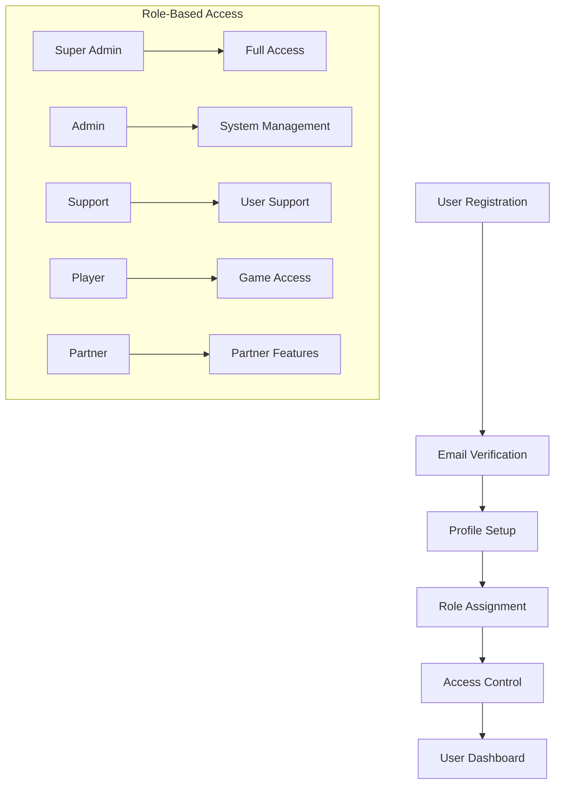
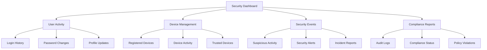
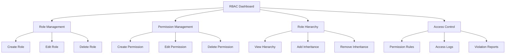
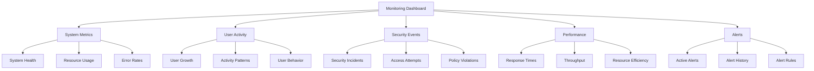

# User Management System

## User Roles and Permissions

### User Levels

```go
// User role definitions
const (
    RoleSuperAdmin = "SUPER_ADMIN"
    RoleAdmin      = "ADMIN"
    RoleSupport    = "SUPPORT"
    RolePlayer     = "PLAYER"
    RolePartner    = "PARTNER"
)

// User status definitions
const (
    StatusActive     = "ACTIVE"
    StatusSuspended  = "SUSPENDED"
    StatusBanned     = "BANNED"
    StatusInactive   = "INACTIVE"
    StatusPending    = "PENDING"
)

// User model
type User struct {
    ID            string    `json:"id"`
    Username      string    `json:"username"`
    Email         string    `json:"email"`
    PasswordHash  string    `json:"-"` // Never expose password hash
    Role          string    `json:"role"`
    Status        string    `json:"status"`
    FirstName     string    `json:"firstName"`
    LastName      string    `json:"lastName"`
    PhoneNumber   string    `json:"phoneNumber,omitempty"`
    Country       string    `json:"country,omitempty"`
    Language      string    `json:"language,omitempty"`
    TimeZone      string    `json:"timeZone,omitempty"`
    LastLoginAt   time.Time `json:"lastLoginAt,omitempty"`
    CreatedAt     time.Time `json:"createdAt"`
    UpdatedAt     time.Time `json:"updatedAt"`
}

// User profile with additional information
type UserProfile struct {
    UserID        string    `json:"userId"`
    Avatar        string    `json:"avatar,omitempty"`
    Bio           string    `json:"bio,omitempty"`
    SocialLinks   []string  `json:"socialLinks,omitempty"`
    Preferences   UserPreferences `json:"preferences"`
    Statistics    UserStatistics  `json:"statistics"`
    CreatedAt     time.Time `json:"createdAt"`
    UpdatedAt     time.Time `json:"updatedAt"`
}

// User preferences
type UserPreferences struct {
    Theme         string    `json:"theme"`
    Notifications []string  `json:"notifications"`
    Privacy       PrivacySettings `json:"privacy"`
    GameSettings  GameSettings    `json:"gameSettings"`
}

// User statistics
type UserStatistics struct {
    GamesPlayed   int       `json:"gamesPlayed"`
    GamesWon      int       `json:"gamesWon"`
    TotalEarnings float64   `json:"totalEarnings"`
    WinRate       float64   `json:"winRate"`
    Rank          int       `json:"rank"`
    Points        int       `json:"points"`
}

// Role-based permissions
type Permission struct {
    Resource      string    `json:"resource"` // e.g., "tables", "tournaments", "users"
    Action        string    `json:"action"`   // e.g., "create", "read", "update", "delete"
    Description   string    `json:"description"`
}

// Extended role definitions
const (
    // System Administration Roles
    RoleSuperAdmin     = "SUPER_ADMIN"
    RoleSystemAdmin    = "SYSTEM_ADMIN"
    RoleSecurityAdmin  = "SECURITY_ADMIN"
    RoleAuditAdmin     = "AUDIT_ADMIN"
    
    // Game Management Roles
    RoleGameAdmin      = "GAME_ADMIN"
    RoleTournamentAdmin = "TOURNAMENT_ADMIN"
    RoleTableAdmin     = "TABLE_ADMIN"
    RoleGameModerator  = "GAME_MODERATOR"
    
    // Financial Management Roles
    RoleFinanceAdmin   = "FINANCE_ADMIN"
    RolePayoutAdmin    = "PAYOUT_ADMIN"
    RoleRefundAdmin    = "REFUND_ADMIN"
    RoleTransactionAdmin = "TRANSACTION_ADMIN"
    
    // User Management Roles
    RoleUserAdmin      = "USER_ADMIN"
    RoleSupportAdmin   = "SUPPORT_ADMIN"
    RoleSupportAgent   = "SUPPORT_AGENT"
    RoleContentModerator = "CONTENT_MODERATOR"
    
    // Partner Management Roles
    RolePartnerAdmin   = "PARTNER_ADMIN"
    RolePartnerManager = "PARTNER_MANAGER"
    RolePartnerAgent   = "PARTNER_AGENT"
    
    // Player Roles
    RolePlayer         = "PLAYER"
    RoleVIPPlayer      = "VIP_PLAYER"
    RoleProPlayer      = "PRO_PLAYER"
    RoleTester         = "TESTER"
)

// Extended role hierarchies mapping
var roleHierarchies = map[string]RoleHierarchy{
    // System Administration Hierarchy
    RoleSuperAdmin: {
        Role: RoleSuperAdmin,
        InheritsFrom: []string{}, // No inheritance
        Description: "Top-level system administrator with full access",
    },
    RoleSystemAdmin: {
        Role: RoleSystemAdmin,
        InheritsFrom: []string{RoleGameAdmin, RoleUserAdmin, RoleFinanceAdmin},
        Description: "System administrator with extensive management capabilities",
    },
    RoleSecurityAdmin: {
        Role: RoleSecurityAdmin,
        InheritsFrom: []string{RoleAuditAdmin},
        Description: "Security administrator with focus on system security",
    },
    RoleAuditAdmin: {
        Role: RoleAuditAdmin,
        InheritsFrom: []string{},
        Description: "Audit administrator with focus on compliance and auditing",
    },
    
    // Game Management Hierarchy
    RoleGameAdmin: {
        Role: RoleGameAdmin,
        InheritsFrom: []string{RoleTournamentAdmin, RoleTableAdmin},
        Description: "Game administrator with overall game management capabilities",
    },
    RoleTournamentAdmin: {
        Role: RoleTournamentAdmin,
        InheritsFrom: []string{RoleGameModerator},
        Description: "Tournament administrator with tournament management capabilities",
    },
    RoleTableAdmin: {
        Role: RoleTableAdmin,
        InheritsFrom: []string{RoleGameModerator},
        Description: "Table administrator with table management capabilities",
    },
    RoleGameModerator: {
        Role: RoleGameModerator,
        InheritsFrom: []string{},
        Description: "Game moderator with basic game management capabilities",
    },
    
    // Financial Management Hierarchy
    RoleFinanceAdmin: {
        Role: RoleFinanceAdmin,
        InheritsFrom: []string{RolePayoutAdmin, RoleRefundAdmin, RoleTransactionAdmin},
        Description: "Finance administrator with overall financial management capabilities",
    },
    RolePayoutAdmin: {
        Role: RolePayoutAdmin,
        InheritsFrom: []string{},
        Description: "Payout administrator with payout management capabilities",
    },
    RoleRefundAdmin: {
        Role: RoleRefundAdmin,
        InheritsFrom: []string{},
        Description: "Refund administrator with refund management capabilities",
    },
    RoleTransactionAdmin: {
        Role: RoleTransactionAdmin,
        InheritsFrom: []string{},
        Description: "Transaction administrator with transaction management capabilities",
    },
    
    // User Management Hierarchy
    RoleUserAdmin: {
        Role: RoleUserAdmin,
        InheritsFrom: []string{RoleSupportAdmin, RoleContentModerator},
        Description: "User administrator with overall user management capabilities",
    },
    RoleSupportAdmin: {
        Role: RoleSupportAdmin,
        InheritsFrom: []string{RoleSupportAgent},
        Description: "Support administrator with support management capabilities",
    },
    RoleSupportAgent: {
        Role: RoleSupportAgent,
        InheritsFrom: []string{},
        Description: "Support agent with basic support capabilities",
    },
    RoleContentModerator: {
        Role: RoleContentModerator,
        InheritsFrom: []string{},
        Description: "Content moderator with content moderation capabilities",
    },
    
    // Partner Management Hierarchy
    RolePartnerAdmin: {
        Role: RolePartnerAdmin,
        InheritsFrom: []string{RolePartnerManager},
        Description: "Partner administrator with overall partner management capabilities",
    },
    RolePartnerManager: {
        Role: RolePartnerManager,
        InheritsFrom: []string{RolePartnerAgent},
        Description: "Partner manager with partner management capabilities",
    },
    RolePartnerAgent: {
        Role: RolePartnerAgent,
        InheritsFrom: []string{},
        Description: "Partner agent with basic partner management capabilities",
    },
    
    // Player Hierarchy
    RolePlayer: {
        Role: RolePlayer,
        InheritsFrom: []string{}, // Base role
        Description: "Regular player with basic access",
    },
    RoleVIPPlayer: {
        Role: RoleVIPPlayer,
        InheritsFrom: []string{RolePlayer},
        Description: "VIP player with enhanced access and benefits",
    },
    RoleProPlayer: {
        Role: RoleProPlayer,
        InheritsFrom: []string{RoleVIPPlayer},
        Description: "Professional player with advanced access and benefits",
    },
    RoleTester: {
        Role: RoleTester,
        InheritsFrom: []string{RolePlayer},
        Description: "Game tester with testing capabilities",
    },
}

// Extended role permissions mapping with granular permissions
var rolePermissions = map[string][]Permission{
    // System Administration Permissions
    RoleSuperAdmin: {
        {Resource: "*", Action: "*", Description: "Full system access"},
        {Resource: "system", Action: "manage", Description: "Manage system configuration"},
        {Resource: "audit", Action: "view", Description: "View all audit logs"},
        {Resource: "backup", Action: "manage", Description: "Manage system backups"},
        {Resource: "security", Action: "manage", Description: "Manage security settings"},
    },
    RoleSystemAdmin: {
        // System Management
        {Resource: "system", Action: "configure", Description: "Configure system settings"},
        {Resource: "system", Action: "monitor", Description: "Monitor system performance"},
        {Resource: "system", Action: "maintain", Description: "Maintain system components"},
        
        // Resource Management
        {Resource: "resources", Action: "allocate", Description: "Allocate system resources"},
        {Resource: "resources", Action: "monitor", Description: "Monitor resource usage"},
        {Resource: "resources", Action: "optimize", Description: "Optimize resource usage"},
    },
    RoleSecurityAdmin: {
        // Security Management
        {Resource: "security", Action: "configure", Description: "Configure security settings"},
        {Resource: "security", Action: "monitor", Description: "Monitor security events"},
        {Resource: "security", Action: "respond", Description: "Respond to security incidents"},
        
        // Access Control
        {Resource: "access", Action: "manage", Description: "Manage access controls"},
        {Resource: "access", Action: "audit", Description: "Audit access patterns"},
        {Resource: "access", Action: "enforce", Description: "Enforce access policies"},
    },
    RoleAuditAdmin: {
        // Audit Management
        {Resource: "audit", Action: "configure", Description: "Configure audit settings"},
        {Resource: "audit", Action: "view", Description: "View audit logs"},
        {Resource: "audit", Action: "export", Description: "Export audit data"},
        
        // Compliance
        {Resource: "compliance", Action: "monitor", Description: "Monitor compliance status"},
        {Resource: "compliance", Action: "report", Description: "Generate compliance reports"},
        {Resource: "compliance", Action: "enforce", Description: "Enforce compliance policies"},
    },
    
    // Game Management Permissions
    RoleGameAdmin: {
        // Game Management
        {Resource: "games", Action: "manage", Description: "Manage all games"},
        {Resource: "games", Action: "configure", Description: "Configure game settings"},
        {Resource: "games", Action: "monitor", Description: "Monitor game activity"},
        
        // Game Rules
        {Resource: "rules", Action: "manage", Description: "Manage game rules"},
        {Resource: "rules", Action: "update", Description: "Update game rules"},
        {Resource: "rules", Action: "enforce", Description: "Enforce game rules"},
    },
    RoleTournamentAdmin: {
        // Tournament Management
        {Resource: "tournaments", Action: "create", Description: "Create tournaments"},
        {Resource: "tournaments", Action: "manage", Description: "Manage tournaments"},
        {Resource: "tournaments", Action: "monitor", Description: "Monitor tournaments"},
        
        // Tournament Settings
        {Resource: "tournaments", Action: "configure", Description: "Configure tournament settings"},
        {Resource: "tournaments", Action: "schedule", Description: "Schedule tournaments"},
        {Resource: "tournaments", Action: "payout", Description: "Manage tournament payouts"},
    },
    RoleTableAdmin: {
        // Table Management
        {Resource: "tables", Action: "create", Description: "Create tables"},
        {Resource: "tables", Action: "manage", Description: "Manage tables"},
        {Resource: "tables", Action: "monitor", Description: "Monitor tables"},
        
        // Table Settings
        {Resource: "tables", Action: "configure", Description: "Configure table settings"},
        {Resource: "tables", Action: "maintain", Description: "Maintain tables"},
        {Resource: "tables", Action: "optimize", Description: "Optimize table performance"},
    },
    RoleGameModerator: {
        // Game Moderation
        {Resource: "games", Action: "moderate", Description: "Moderate games"},
        {Resource: "games", Action: "resolve", Description: "Resolve game disputes"},
        {Resource: "games", Action: "report", Description: "Report game issues"},
        
        // Player Management
        {Resource: "players", Action: "warn", Description: "Warn players"},
        {Resource: "players", Action: "mute", Description: "Mute players"},
        {Resource: "players", Action: "kick", Description: "Kick players"},
    },
    
    // Financial Management Permissions
    RoleFinanceAdmin: {
        // Financial Management
        {Resource: "finance", Action: "manage", Description: "Manage financial operations"},
        {Resource: "finance", Action: "monitor", Description: "Monitor financial activity"},
        {Resource: "finance", Action: "report", Description: "Generate financial reports"},
        
        // Financial Settings
        {Resource: "finance", Action: "configure", Description: "Configure financial settings"},
        {Resource: "finance", Action: "audit", Description: "Audit financial operations"},
        {Resource: "finance", Action: "optimize", Description: "Optimize financial processes"},
    },
    RolePayoutAdmin: {
        // Payout Management
        {Resource: "payouts", Action: "process", Description: "Process payouts"},
        {Resource: "payouts", Action: "verify", Description: "Verify payouts"},
        {Resource: "payouts", Action: "report", Description: "Report payout issues"},
        
        // Payout Settings
        {Resource: "payouts", Action: "configure", Description: "Configure payout settings"},
        {Resource: "payouts", Action: "monitor", Description: "Monitor payout activity"},
        {Resource: "payouts", Action: "optimize", Description: "Optimize payout processes"},
    },
    RoleRefundAdmin: {
        // Refund Management
        {Resource: "refunds", Action: "process", Description: "Process refunds"},
        {Resource: "refunds", Action: "verify", Description: "Verify refunds"},
        {Resource: "refunds", Action: "report", Description: "Report refund issues"},
        
        // Refund Settings
        {Resource: "refunds", Action: "configure", Description: "Configure refund settings"},
        {Resource: "refunds", Action: "monitor", Description: "Monitor refund activity"},
        {Resource: "refunds", Action: "optimize", Description: "Optimize refund processes"},
    },
    RoleTransactionAdmin: {
        // Transaction Management
        {Resource: "transactions", Action: "view", Description: "View transactions"},
        {Resource: "transactions", Action: "verify", Description: "Verify transactions"},
        {Resource: "transactions", Action: "report", Description: "Report transaction issues"},
        
        // Transaction Settings
        {Resource: "transactions", Action: "configure", Description: "Configure transaction settings"},
        {Resource: "transactions", Action: "monitor", Description: "Monitor transaction activity"},
        {Resource: "transactions", Action: "optimize", Description: "Optimize transaction processes"},
    },
    
    // User Management Permissions
    RoleUserAdmin: {
        // User Management
        {Resource: "users", Action: "manage", Description: "Manage all users"},
        {Resource: "users", Action: "monitor", Description: "Monitor user activity"},
        {Resource: "users", Action: "report", Description: "Generate user reports"},
        
        // User Settings
        {Resource: "users", Action: "configure", Description: "Configure user settings"},
        {Resource: "users", Action: "audit", Description: "Audit user activity"},
        {Resource: "users", Action: "optimize", Description: "Optimize user management"},
    },
    RoleSupportAdmin: {
        // Support Management
        {Resource: "support", Action: "manage", Description: "Manage support operations"},
        {Resource: "support", Action: "monitor", Description: "Monitor support activity"},
        {Resource: "support", Action: "report", Description: "Generate support reports"},
        
        // Support Settings
        {Resource: "support", Action: "configure", Description: "Configure support settings"},
        {Resource: "support", Action: "train", Description: "Train support staff"},
        {Resource: "support", Action: "optimize", Description: "Optimize support processes"},
    },
    RoleSupportAgent: {
        // Support Operations
        {Resource: "tickets", Action: "view", Description: "View support tickets"},
        {Resource: "tickets", Action: "respond", Description: "Respond to tickets"},
        {Resource: "tickets", Action: "resolve", Description: "Resolve tickets"},
        
        // User Support
        {Resource: "users", Action: "view", Description: "View user information"},
        {Resource: "users", Action: "assist", Description: "Assist users"},
        {Resource: "users", Action: "report", Description: "Report user issues"},
    },
    RoleContentModerator: {
        // Content Moderation
        {Resource: "content", Action: "review", Description: "Review content"},
        {Resource: "content", Action: "moderate", Description: "Moderate content"},
        {Resource: "content", Action: "report", Description: "Report content issues"},
        
        // User Content
        {Resource: "users", Action: "warn", Description: "Warn users"},
        {Resource: "users", Action: "mute", Description: "Mute users"},
        {Resource: "users", Action: "ban", Description: "Ban users"},
    },
    
    // Partner Management Permissions
    RolePartnerAdmin: {
        // Partner Management
        {Resource: "partners", Action: "manage", Description: "Manage all partners"},
        {Resource: "partners", Action: "monitor", Description: "Monitor partner activity"},
        {Resource: "partners", Action: "report", Description: "Generate partner reports"},
        
        // Partner Settings
        {Resource: "partners", Action: "configure", Description: "Configure partner settings"},
        {Resource: "partners", Action: "audit", Description: "Audit partner activity"},
        {Resource: "partners", Action: "optimize", Description: "Optimize partner management"},
    },
    RolePartnerManager: {
        // Partner Operations
        {Resource: "partners", Action: "view", Description: "View partner information"},
        {Resource: "partners", Action: "manage", Description: "Manage partner accounts"},
        {Resource: "partners", Action: "monitor", Description: "Monitor partner activity"},
        
        // Partner Support
        {Resource: "partners", Action: "support", Description: "Support partners"},
        {Resource: "partners", Action: "train", Description: "Train partners"},
        {Resource: "partners", Action: "report", Description: "Report partner issues"},
    },
    RolePartnerAgent: {
        // Partner Support
        {Resource: "partners", Action: "view", Description: "View partner information"},
        {Resource: "partners", Action: "assist", Description: "Assist partners"},
        {Resource: "partners", Action: "report", Description: "Report partner issues"},
        
        // Partner Operations
        {Resource: "partners", Action: "monitor", Description: "Monitor partner activity"},
        {Resource: "partners", Action: "support", Description: "Support partner operations"},
        {Resource: "partners", Action: "report", Description: "Report partner operations"},
    },
    
    // Player Permissions
    RolePlayer: {
        // Game Access
        {Resource: "tables", Action: "join", Description: "Join available tables"},
        {Resource: "tables", Action: "leave", Description: "Leave tables"},
        {Resource: "tables", Action: "view", Description: "View table information"},
        {Resource: "tournaments", Action: "join", Description: "Join available tournaments"},
        {Resource: "tournaments", Action: "view", Description: "View tournament information"},
        
        // Profile Management
        {Resource: "profile", Action: "manage", Description: "Manage own profile"},
        {Resource: "profile", Action: "view", Description: "View own profile"},
        {Resource: "profile", Action: "update", Description: "Update own profile"},
        
        // Financial
        {Resource: "balance", Action: "view", Description: "View own balance"},
        {Resource: "transactions", Action: "view", Description: "View own transactions"},
        {Resource: "tickets", Action: "view", Description: "View own tickets"},
        
        // Social
        {Resource: "friends", Action: "manage", Description: "Manage friends list"},
        {Resource: "chat", Action: "use", Description: "Use chat system"},
    },
    RoleVIPPlayer: {
        // VIP Benefits
        {Resource: "vip", Action: "access", Description: "Access VIP features"},
        {Resource: "vip", Action: "benefits", Description: "Use VIP benefits"},
        {Resource: "vip", Action: "support", Description: "Access VIP support"},
        
        // Enhanced Access
        {Resource: "tables", Action: "priority", Description: "Priority table access"},
        {Resource: "tournaments", Action: "priority", Description: "Priority tournament access"},
        {Resource: "events", Action: "exclusive", Description: "Access exclusive events"},
    },
    RoleProPlayer: {
        // Professional Benefits
        {Resource: "pro", Action: "access", Description: "Access professional features"},
        {Resource: "pro", Action: "benefits", Description: "Use professional benefits"},
        {Resource: "pro", Action: "support", Description: "Access professional support"},
        
        // Advanced Access
        {Resource: "tables", Action: "exclusive", Description: "Exclusive table access"},
        {Resource: "tournaments", Action: "exclusive", Description: "Exclusive tournament access"},
        {Resource: "events", Action: "premium", Description: "Access premium events"},
    },
    RoleTester: {
        // Testing Access
        {Resource: "testing", Action: "access", Description: "Access testing features"},
        {Resource: "testing", Action: "report", Description: "Report test results"},
        {Resource: "testing", Action: "feedback", Description: "Provide testing feedback"},
        
        // Test Environment
        {Resource: "test", Action: "environment", Description: "Access test environment"},
        {Resource: "test", Action: "features", Description: "Test new features"},
        {Resource: "test", Action: "bugs", Description: "Report bugs and issues"},
    },
}

// User service interface
type UserService interface {
    // User Management
    CreateUser(ctx context.Context, user *User) error
    GetUser(ctx context.Context, userID string) (*User, error)
    UpdateUser(ctx context.Context, userID string, updates map[string]interface{}) error
    DeleteUser(ctx context.Context, userID string) error
    ListUsers(ctx context.Context, filter UserFilter) ([]User, error)
    
    // Authentication
    Authenticate(ctx context.Context, username, password string) (*User, error)
    ChangePassword(ctx context.Context, userID, oldPassword, newPassword string) error
    ResetPassword(ctx context.Context, email string) error
    
    // Role Management
    AssignRole(ctx context.Context, userID, role string) error
    RevokeRole(ctx context.Context, userID, role string) error
    GetUserPermissions(ctx context.Context, userID string) ([]Permission, error)
    
    // Profile Management
    GetUserProfile(ctx context.Context, userID string) (*UserProfile, error)
    UpdateUserProfile(ctx context.Context, userID string, profile *UserProfile) error
    
    // Status Management
    UpdateUserStatus(ctx context.Context, userID, status string) error
    SuspendUser(ctx context.Context, userID string, reason string) error
    BanUser(ctx context.Context, userID string, reason string) error
    ActivateUser(ctx context.Context, userID string) error
    
    // Security Management
    EnableTwoFactor(ctx context.Context, userID string, method string) error
    DisableTwoFactor(ctx context.Context, userID string) error
    VerifyTwoFactor(ctx context.Context, userID string, code string) error
    GenerateBackupCodes(ctx context.Context, userID string) ([]string, error)
    
    // Device Management
    RegisterDevice(ctx context.Context, userID string, device *Device) error
    RemoveDevice(ctx context.Context, userID string, deviceID string) error
    ListDevices(ctx context.Context, userID string) ([]Device, error)
    TrustDevice(ctx context.Context, userID string, deviceID string) error
    
    // Account Recovery
    SetRecoveryEmail(ctx context.Context, userID string, email string) error
    SetRecoveryPhone(ctx context.Context, userID string, phone string) error
    SetSecurityQuestions(ctx context.Context, userID string, questions []SecurityQuestion) error
    VerifySecurityQuestions(ctx context.Context, userID string, answers []string) error
    
    // Activity Monitoring
    GetLoginHistory(ctx context.Context, userID string) ([]LoginHistory, error)
    GetActivityLog(ctx context.Context, userID string) ([]ActivityLog, error)
    GetPasswordHistory(ctx context.Context, userID string) ([]PasswordHistory, error)
    
    // Security Settings
    UpdateSecuritySettings(ctx context.Context, userID string, settings *SecuritySettings) error
    GetSecuritySettings(ctx context.Context, userID string) (*SecuritySettings, error)
}

// User filter for listing users
type UserFilter struct {
    Role        string    `json:"role,omitempty"`
    Status      string    `json:"status,omitempty"`
    Country     string    `json:"country,omitempty"`
    CreatedFrom time.Time `json:"createdFrom,omitempty"`
    CreatedTo   time.Time `json:"createdTo,omitempty"`
    Search      string    `json:"search,omitempty"`
}

// User service implementation
type userService struct {
    userRepo      repository.UserRepository
    profileRepo   repository.UserProfileRepository
    authService   *auth.Service
    eventBus      *eventbus.EventBus
    logger        *zap.Logger
}

// Example implementation of user creation with role validation
func (s *userService) CreateUser(ctx context.Context, user *User) error {
    // Validate role
    if _, exists := rolePermissions[user.Role]; !exists {
        return fmt.Errorf("invalid role: %s", user.Role)
    }
    
    // Hash password
    hashedPassword, err := s.authService.HashPassword(user.PasswordHash)
    if err != nil {
        return fmt.Errorf("hash password: %w", err)
    }
    user.PasswordHash = hashedPassword
    
    // Set default status
    user.Status = StatusPending
    user.CreatedAt = time.Now()
    user.UpdatedAt = time.Now()
    
    // Create user
    if err := s.userRepo.Create(ctx, user); err != nil {
        return fmt.Errorf("create user: %w", err)
    }
    
    // Create user profile
    profile := &UserProfile{
        UserID: user.ID,
        Preferences: UserPreferences{
            Theme: "light",
            Notifications: []string{"email", "push"},
        },
        CreatedAt: time.Now(),
        UpdatedAt: time.Now(),
    }
    
    if err := s.profileRepo.Create(ctx, profile); err != nil {
        // Rollback user creation
        s.userRepo.Delete(ctx, user.ID)
        return fmt.Errorf("create profile: %w", err)
    }
    
    // Publish user created event
    s.eventBus.Publish(UserEvent{
        Type: "USER_CREATED",
        UserID: user.ID,
        Role: user.Role,
        Timestamp: time.Now(),
    })
    
    return nil
}

// Example implementation of permission checking
func (s *userService) HasPermission(ctx context.Context, userID, resource, action string) (bool, error) {
    user, err := s.userRepo.Get(ctx, userID)
    if err != nil {
        return false, fmt.Errorf("get user: %w", err)
    }
    
    permissions, exists := rolePermissions[user.Role]
    if !exists {
        return false, nil
    }
    
    // Super admin has all permissions
    if user.Role == RoleSuperAdmin {
        return true, nil
    }
    
    // Check specific permissions
    for _, permission := range permissions {
        if (permission.Resource == resource || permission.Resource == "*") &&
           (permission.Action == action || permission.Action == "*") {
            return true, nil
        }
    }
    
    return false, nil
}

// Example implementation of user suspension
func (s *userService) SuspendUser(ctx context.Context, userID string, reason string) error {
    user, err := s.userRepo.Get(ctx, userID)
    if err != nil {
        return fmt.Errorf("get user: %w", err)
    }
    
    // Cannot suspend super admin
    if user.Role == RoleSuperAdmin {
        return errors.New("cannot suspend super admin")
    }
    
    // Update user status
    updates := map[string]interface{}{
        "status": StatusSuspended,
        "updated_at": time.Now(),
    }
    
    if err := s.userRepo.Update(ctx, userID, updates); err != nil {
        return fmt.Errorf("update user: %w", err)
    }
    
    // Publish user suspended event
    s.eventBus.Publish(UserEvent{
        Type: "USER_SUSPENDED",
        UserID: userID,
        Reason: reason,
        Timestamp: time.Now(),
    })
    
    return nil
}

// Example implementation of enhanced security measures
func (s *userService) EnableTwoFactor(ctx context.Context, userID string, method string) error {
    user, err := s.userRepo.Get(ctx, userID)
    if err != nil {
        return fmt.Errorf("get user: %w", err)
    }
    
    // Generate 2FA secret
    secret, err := s.authService.GenerateTwoFactorSecret()
    if err != nil {
        return fmt.Errorf("generate 2FA secret: %w", err)
    }
    
    // Store 2FA settings
    updates := map[string]interface{}{
        "two_factor_enabled": true,
        "two_factor_method": method,
        "two_factor_secret": secret,
        "updated_at": time.Now(),
    }
    
    if err := s.userRepo.Update(ctx, userID, updates); err != nil {
        return fmt.Errorf("update user: %w", err)
    }
    
    // Generate backup codes
    backupCodes, err := s.GenerateBackupCodes(ctx, userID)
    if err != nil {
        return fmt.Errorf("generate backup codes: %w", err)
    }
    
    // Send 2FA setup instructions
    if err := s.notificationService.SendTwoFactorSetup(user.Email, method, secret, backupCodes); err != nil {
        return fmt.Errorf("send 2FA setup: %w", err)
    }
    
    // Log activity
    s.logger.Info("2FA enabled",
        zap.String("user_id", userID),
        zap.String("method", method))
    
    return nil
}

// Example implementation of device registration
func (s *userService) RegisterDevice(ctx context.Context, userID string, device *Device) error {
    // Validate device information
    if err := s.validateDevice(device); err != nil {
        return fmt.Errorf("validate device: %w", err)
    }
    
    // Check device limit
    devices, err := s.ListDevices(ctx, userID)
    if err != nil {
        return fmt.Errorf("list devices: %w", err)
    }
    
    if len(devices) >= s.config.MaxDevices {
        return errors.New("device limit reached")
    }
    
    // Store device information
    device.ID = uuid.New().String()
    device.LastUsed = time.Now()
    
    if err := s.deviceRepo.Create(ctx, userID, device); err != nil {
        return fmt.Errorf("create device: %w", err)
    }
    
    // Log activity
    s.logger.Info("device registered",
        zap.String("user_id", userID),
        zap.String("device_id", device.ID))
    
    return nil
}

// Example implementation of activity logging
func (s *userService) LogActivity(ctx context.Context, userID string, action, resource, details string) error {
    activity := &ActivityLog{
        ID:        uuid.New().String(),
        Action:    action,
        Resource:  resource,
        Details:   details,
        IP:        ctx.Value("ip").(string),
        DeviceID:  ctx.Value("device_id").(string),
        Timestamp: time.Now(),
    }
    
    if err := s.activityRepo.Create(ctx, userID, activity); err != nil {
        return fmt.Errorf("create activity log: %w", err)
    }
    
    // Check for suspicious activity
    if s.isSuspiciousActivity(activity) {
        s.notificationService.SendSecurityAlert(userID, "Suspicious activity detected")
    }
    
    return nil
}

## User Management Features

### 1. Authentication and Authorization
- JWT-based authentication
- Role-based access control (RBAC)
- Permission-based authorization
- Session management
- Password policies and security

### 2. User Profile Management
- Basic information
- Profile customization
- Privacy settings
- Game preferences
- Notification preferences

### 3. User Statistics
- Game history
- Performance metrics
- Achievement tracking
- Ranking system
- Points system

### 4. Administrative Features
- User management dashboard
- Role management
- User monitoring
- Activity logging
- Report generation

### 5. Security Features
- Password hashing
- Two-factor authentication
- IP tracking
- Suspicious activity detection
- Account recovery

### 6. Partner Management
- Partner dashboard
- Revenue sharing
- Promotion management
- Analytics and reporting
- Custom branding

## User Management Flow



## User Management API

### Authentication Endpoints
```go
// Authentication routes
func (s *Server) setupAuthRoutes(r *gin.Engine) {
    auth := r.Group("/api/auth")
    {
        auth.POST("/login", s.handleLogin)
        auth.POST("/register", s.handleRegister)
        auth.POST("/logout", s.handleLogout)
        auth.POST("/refresh-token", s.handleRefreshToken)
        auth.POST("/forgot-password", s.handleForgotPassword)
        auth.POST("/reset-password", s.handleResetPassword)
    }
}
```

### User Management Endpoints
```go
// User management routes
func (s *Server) setupUserRoutes(r *gin.Engine) {
    users := r.Group("/api/users")
    users.Use(s.authMiddleware())
    {
        users.GET("/", s.handleListUsers)
        users.GET("/:id", s.handleGetUser)
        users.POST("/", s.handleCreateUser)
        users.PUT("/:id", s.handleUpdateUser)
        users.DELETE("/:id", s.handleDeleteUser)
        users.PUT("/:id/status", s.handleUpdateUserStatus)
        users.PUT("/:id/role", s.handleUpdateUserRole)
    }
}
```

### Profile Management Endpoints
```go
// Profile management routes
func (s *Server) setupProfileRoutes(r *gin.Engine) {
    profiles := r.Group("/api/profiles")
    profiles.Use(s.authMiddleware())
    {
        profiles.GET("/me", s.handleGetMyProfile)
        profiles.PUT("/me", s.handleUpdateMyProfile)
        profiles.GET("/:id", s.handleGetUserProfile)
        profiles.PUT("/:id", s.handleUpdateUserProfile)
    }
}
```

## User Management Events

```go
// User-related events
type UserEvent struct {
    Type      string    `json:"type"`
    UserID    string    `json:"userId"`
    Role      string    `json:"role,omitempty"`
    Reason    string    `json:"reason,omitempty"`
    Timestamp time.Time `json:"timestamp"`
}

// Event types
const (
    EventUserCreated    = "USER_CREATED"
    EventUserUpdated    = "USER_UPDATED"
    EventUserDeleted    = "USER_DELETED"
    EventUserSuspended  = "USER_SUSPENDED"
    EventUserBanned     = "USER_BANNED"
    EventUserActivated  = "USER_ACTIVATED"
    EventRoleChanged    = "ROLE_CHANGED"
    EventPasswordChanged = "PASSWORD_CHANGED"
)
```

## User Management Monitoring

### 1. Activity Monitoring
- Login attempts
- Password changes
- Profile updates
- Role changes
- Status changes

### 2. Security Monitoring
- Failed login attempts
- Suspicious IP addresses
- Multiple account detection
- Unauthorized access attempts

### 3. Performance Monitoring
- API response times
- Database query times
- Cache hit rates
- Resource usage

### 4. User Analytics
- User growth
- Role distribution
- Geographic distribution
- Activity patterns
- Retention rates

## Enhanced Security Features

### 1. Multi-factor Authentication
- Two-factor authentication (2FA)
- Multiple 2FA methods (SMS, Email, Authenticator)
- Backup codes
- Device-based authentication
- Biometric authentication (future)

### 2. Device Management
- Device registration and tracking
- Trusted device system
- Device-based restrictions
- Remote device management
- Device activity monitoring

### 3. Account Recovery
- Multiple recovery methods
- Security questions
- Recovery email/phone
- Backup codes
- Account restoration

### 4. Activity Monitoring
- Detailed login history
- Password change tracking
- Activity logging
- Suspicious activity detection
- Real-time alerts

### 5. Security Policies
- Password policies
- Session management
- IP restrictions
- Rate limiting
- KYC requirements

### 6. Compliance and Auditing
- Activity audit logs
- Security event logging
- Compliance reporting
- Data retention policies
- Privacy controls

## Security Monitoring Dashboard



## Security API Endpoints

```go
// Security management routes
func (s *Server) setupSecurityRoutes(r *gin.Engine) {
    security := r.Group("/api/security")
    security.Use(s.authMiddleware())
    {
        // 2FA Management
        security.POST("/2fa/enable", s.handleEnable2FA)
        security.POST("/2fa/disable", s.handleDisable2FA)
        security.POST("/2fa/verify", s.handleVerify2FA)
        security.POST("/2fa/backup-codes", s.handleGenerateBackupCodes)
        
        // Device Management
        security.POST("/devices", s.handleRegisterDevice)
        security.DELETE("/devices/:id", s.handleRemoveDevice)
        security.GET("/devices", s.handleListDevices)
        security.PUT("/devices/:id/trust", s.handleTrustDevice)
        
        // Account Recovery
        security.POST("/recovery/email", s.handleSetRecoveryEmail)
        security.POST("/recovery/phone", s.handleSetRecoveryPhone)
        security.POST("/recovery/questions", s.handleSetSecurityQuestions)
        security.POST("/recovery/verify", s.handleVerifySecurityQuestions)
        
        // Activity Monitoring
        security.GET("/activity/login", s.handleGetLoginHistory)
        security.GET("/activity/log", s.handleGetActivityLog)
        security.GET("/activity/password", s.handleGetPasswordHistory)
        
        // Security Settings
        security.GET("/settings", s.handleGetSecuritySettings)
        security.PUT("/settings", s.handleUpdateSecuritySettings)
    }
}
```

## Security Events

```go
// Security-related events
type SecurityEvent struct {
    Type        string    `json:"type"`
    UserID      string    `json:"userId"`
    DeviceID    string    `json:"deviceId,omitempty"`
    IP          string    `json:"ip"`
    Details     string    `json:"details"`
    Severity    string    `json:"severity"` // "low", "medium", "high", "critical"
    Timestamp   time.Time `json:"timestamp"`
}

// Security event types
const (
    EventLoginAttempt     = "LOGIN_ATTEMPT"
    EventLoginSuccess     = "LOGIN_SUCCESS"
    EventLoginFailed      = "LOGIN_FAILED"
    EventPasswordChange   = "PASSWORD_CHANGE"
    Event2FAEnabled       = "2FA_ENABLED"
    Event2FADisabled      = "2FA_DISABLED"
    EventDeviceAdded      = "DEVICE_ADDED"
    EventDeviceRemoved    = "DEVICE_REMOVED"
    EventSuspiciousActivity = "SUSPICIOUS_ACTIVITY"
    EventSecurityAlert    = "SECURITY_ALERT"
)
```

## Security Monitoring

### 1. Real-time Monitoring
- Login attempts
- Password changes
- Profile updates
- Device changes
- Security settings changes

### 2. Suspicious Activity Detection
- Multiple failed login attempts
- Unusual login locations
- Rapid password changes
- Multiple device registrations
- Unusual activity patterns

### 3. Security Alerts
- Email notifications
- SMS notifications
- In-app notifications
- Dashboard alerts
- Incident reports

### 4. Compliance Monitoring
- Policy violations
- Security incidents
- Data breaches
- Access violations
- Audit trail

### 5. Performance Monitoring
- Authentication latency
- API response times
- Database performance
- Cache efficiency
- Resource usage

## Role-Based Access Control

### Role Hierarchy Definitions

```go
// Role hierarchy definitions
type RoleHierarchy struct {
    Role          string   `json:"role"`
    InheritsFrom  []string `json:"inheritsFrom"` // Roles this role inherits from
    Description   string   `json:"description"`
}

// Role hierarchies mapping
var roleHierarchies = map[string]RoleHierarchy{
    RoleSuperAdmin: {
        Role: RoleSuperAdmin,
        InheritsFrom: []string{}, // No inheritance
        Description: "Top-level system administrator with full access",
    },
    RoleAdmin: {
        Role: RoleAdmin,
        InheritsFrom: []string{RoleSupport},
        Description: "System administrator with extensive management capabilities",
    },
    RoleSupport: {
        Role: RoleSupport,
        InheritsFrom: []string{RolePlayer},
        Description: "Support staff with elevated access for user assistance",
    },
    RolePartner: {
        Role: RolePartner,
        InheritsFrom: []string{RolePlayer},
        Description: "Partner with additional management capabilities",
    },
    RolePlayer: {
        Role: RolePlayer,
        InheritsFrom: []string{}, // Base role
        Description: "Regular player with basic access",
    },
}

// Resource categories for better organization
type ResourceCategory struct {
    Name        string   `json:"name"`
    Resources   []string `json:"resources"`
    Description string   `json:"description"`
}

// Resource categories mapping
var resourceCategories = map[string]ResourceCategory{
    "user_management": {
        Name: "User Management",
        Resources: []string{"users", "profiles", "roles", "permissions"},
        Description: "User-related resources and operations",
    },
    "game_management": {
        Name: "Game Management",
        Resources: []string{"tables", "tournaments", "games", "results"},
        Description: "Game-related resources and operations",
    },
    "financial_management": {
        Name: "Financial Management",
        Resources: []string{"transactions", "payouts", "refunds", "balances"},
        Description: "Financial-related resources and operations",
    },
    "system_management": {
        Name: "System Management",
        Resources: []string{"settings", "configurations", "logs", "backups"},
        Description: "System-related resources and operations",
    },
    "security_management": {
        Name: "Security Management",
        Resources: []string{"security", "audit", "compliance", "devices"},
        Description: "Security-related resources and operations",
    },
    "reporting_management": {
        Name: "Reporting Management",
        Resources: []string{"reports", "analytics", "statistics", "metrics"},
        Description: "Reporting-related resources and operations",
    },
}

// Enhanced permission structure
type Permission struct {
    Resource      string    `json:"resource"`
    Action        string    `json:"action"`
    Description   string    `json:"description"`
    Category      string    `json:"category"`
    RequiredRoles []string  `json:"requiredRoles,omitempty"`
    Conditions    []string  `json:"conditions,omitempty"` // Additional conditions for permission
}

// Dynamic permission rules
type PermissionRule struct {
    ID          string    `json:"id"`
    Name        string    `json:"name"`
    Description string    `json:"description"`
    Resource    string    `json:"resource"`
    Action      string    `json:"action"`
    Conditions  []string  `json:"conditions"`
    Effect      string    `json:"effect"` // "allow" or "deny"
    Priority    int       `json:"priority"`
    CreatedAt   time.Time `json:"createdAt"`
    UpdatedAt   time.Time `json:"updatedAt"`
}

// Role-based access control service interface
type RBACService interface {
    // Role Management
    CreateRole(ctx context.Context, role *Role) error
    UpdateRole(ctx context.Context, roleID string, updates map[string]interface{}) error
    DeleteRole(ctx context.Context, roleID string) error
    GetRole(ctx context.Context, roleID string) (*Role, error)
    ListRoles(ctx context.Context) ([]Role, error)
    
    // Permission Management
    CreatePermission(ctx context.Context, permission *Permission) error
    UpdatePermission(ctx context.Context, permissionID string, updates map[string]interface{}) error
    DeletePermission(ctx context.Context, permissionID string) error
    GetPermission(ctx context.Context, permissionID string) (*Permission, error)
    ListPermissions(ctx context.Context) ([]Permission, error)
    
    // Role-Permission Assignment
    AssignPermissionToRole(ctx context.Context, roleID, permissionID string) error
    RevokePermissionFromRole(ctx context.Context, roleID, permissionID string) error
    GetRolePermissions(ctx context.Context, roleID string) ([]Permission, error)
    
    // Dynamic Rules
    CreatePermissionRule(ctx context.Context, rule *PermissionRule) error
    UpdatePermissionRule(ctx context.Context, ruleID string, updates map[string]interface{}) error
    DeletePermissionRule(ctx context.Context, ruleID string) error
    ListPermissionRules(ctx context.Context) ([]PermissionRule, error)
    
    // Permission Checking
    HasPermission(ctx context.Context, userID, resource, action string) (bool, error)
    CheckPermissions(ctx context.Context, userID string, permissions []Permission) (map[string]bool, error)
    
    // Role Hierarchy
    AddRoleInheritance(ctx context.Context, roleID, parentRoleID string) error
    RemoveRoleInheritance(ctx context.Context, roleID, parentRoleID string) error
    GetRoleHierarchy(ctx context.Context, roleID string) ([]string, error)
}

// Example implementation of permission checking with role hierarchy
func (s *rbacService) HasPermission(ctx context.Context, userID, resource, action string) (bool, error) {
    user, err := s.userRepo.Get(ctx, userID)
    if err != nil {
        return false, fmt.Errorf("get user: %w", err)
    }
    
    // Get role hierarchy
    hierarchy, err := s.GetRoleHierarchy(ctx, user.Role)
    if err != nil {
        return false, fmt.Errorf("get role hierarchy: %w", err)
    }
    
    // Check permissions for each role in hierarchy
    for _, role := range hierarchy {
        permissions, err := s.GetRolePermissions(ctx, role)
        if err != nil {
            return false, fmt.Errorf("get role permissions: %w", err)
        }
        
        // Check direct permissions
        for _, permission := range permissions {
            if permission.Resource == resource && permission.Action == action {
                return true, nil
            }
        }
        
        // Check dynamic rules
        rules, err := s.ListPermissionRules(ctx)
        if err != nil {
            return false, fmt.Errorf("list permission rules: %w", err)
        }
        
        for _, rule := range rules {
            if rule.Resource == resource && rule.Action == action {
                // Apply rule conditions
                if s.evaluateRuleConditions(rule, user) {
                    return rule.Effect == "allow", nil
                }
            }
        }
    }
    
    return false, nil
}

// Example implementation of dynamic permission rule evaluation
func (s *rbacService) evaluateRuleConditions(rule *PermissionRule, user *User) bool {
    for _, condition := range rule.Conditions {
        switch condition {
        case "is_verified":
            if !user.IsVerified {
                return false
            }
        case "has_kyc":
            if !user.HasKYC {
                return false
            }
        case "is_vip":
            if !user.IsVIP {
                return false
            }
        case "has_minimum_balance":
            if user.Balance < 1000 {
                return false
            }
        case "is_restricted_country":
            if s.isRestrictedCountry(user.Country) {
                return false
            }
        }
    }
    return true
}

// Example implementation of role hierarchy management
func (s *rbacService) AddRoleInheritance(ctx context.Context, roleID, parentRoleID string) error {
    // Validate roles exist
    role, err := s.GetRole(ctx, roleID)
    if err != nil {
        return fmt.Errorf("get role: %w", err)
    }
    
    parentRole, err := s.GetRole(ctx, parentRoleID)
    if err != nil {
        return fmt.Errorf("get parent role: %w", err)
    }
    
    // Check for circular inheritance
    if s.wouldCreateCircularInheritance(roleID, parentRoleID) {
        return errors.New("circular inheritance detected")
    }
    
    // Add inheritance
    updates := map[string]interface{}{
        "inherits_from": append(role.InheritsFrom, parentRoleID),
        "updated_at": time.Now(),
    }
    
    if err := s.roleRepo.Update(ctx, roleID, updates); err != nil {
        return fmt.Errorf("update role: %w", err)
    }
    
    // Log role hierarchy change
    s.logger.Info("role inheritance added",
        zap.String("role_id", roleID),
        zap.String("parent_role_id", parentRoleID))
    
    return nil
}

## Role-Based Access Control Dashboard



## RBAC API Endpoints

```go
// RBAC management routes
func (s *Server) setupRBACRoutes(r *gin.Engine) {
    rbac := r.Group("/api/rbac")
    rbac.Use(s.authMiddleware())
    {
        // Role Management
        rbac.POST("/roles", s.handleCreateRole)
        rbac.PUT("/roles/:id", s.handleUpdateRole)
        rbac.DELETE("/roles/:id", s.handleDeleteRole)
        rbac.GET("/roles", s.handleListRoles)
        rbac.GET("/roles/:id", s.handleGetRole)
        
        // Permission Management
        rbac.POST("/permissions", s.handleCreatePermission)
        rbac.PUT("/permissions/:id", s.handleUpdatePermission)
        rbac.DELETE("/permissions/:id", s.handleDeletePermission)
        rbac.GET("/permissions", s.handleListPermissions)
        rbac.GET("/permissions/:id", s.handleGetPermission)
        
        // Role-Permission Assignment
        rbac.POST("/roles/:id/permissions", s.handleAssignPermission)
        rbac.DELETE("/roles/:id/permissions/:permissionId", s.handleRevokePermission)
        rbac.GET("/roles/:id/permissions", s.handleGetRolePermissions)
        
        // Dynamic Rules
        rbac.POST("/rules", s.handleCreateRule)
        rbac.PUT("/rules/:id", s.handleUpdateRule)
        rbac.DELETE("/rules/:id", s.handleDeleteRule)
        rbac.GET("/rules", s.handleListRules)
        
        // Role Hierarchy
        rbac.POST("/roles/:id/inheritance", s.handleAddInheritance)
        rbac.DELETE("/roles/:id/inheritance/:parentId", s.handleRemoveInheritance)
        rbac.GET("/roles/:id/hierarchy", s.handleGetHierarchy)
    }
}
```

## RBAC Events

```go
// RBAC-related events
type RBACEvent struct {
    Type        string    `json:"type"`
    RoleID      string    `json:"roleId,omitempty"`
    PermissionID string   `json:"permissionId,omitempty"`
    RuleID      string    `json:"ruleId,omitempty"`
    Action      string    `json:"action"`
    Details     string    `json:"details"`
    Timestamp   time.Time `json:"timestamp"`
}

// RBAC event types
const (
    EventRoleCreated      = "ROLE_CREATED"
    EventRoleUpdated      = "ROLE_UPDATED"
    EventRoleDeleted      = "ROLE_DELETED"
    EventPermissionCreated = "PERMISSION_CREATED"
    EventPermissionUpdated = "PERMISSION_UPDATED"
    EventPermissionDeleted = "PERMISSION_DELETED"
    EventPermissionAssigned = "PERMISSION_ASSIGNED"
    EventPermissionRevoked = "PERMISSION_REVOKED"
    EventRuleCreated     = "RULE_CREATED"
    EventRuleUpdated     = "RULE_UPDATED"
    EventRuleDeleted     = "RULE_DELETED"
    EventHierarchyChanged = "HIERARCHY_CHANGED"
)
```

## RBAC Monitoring

### 1. Role Usage Monitoring
- Role assignments
- Permission usage
- Access patterns
- Violation attempts
- Hierarchy changes

### 2. Permission Analysis
- Permission distribution
- Access frequency
- Unused permissions
- Permission conflicts
- Rule effectiveness

### 3. Security Monitoring
- Permission violations
- Unauthorized access attempts
- Role escalation attempts
- Policy violations
- Audit trail

### 4. Performance Monitoring
- Permission check latency
- Cache hit rates
- Database performance
- Rule evaluation time
- Resource usage

### 5. Compliance Monitoring
- Policy compliance
- Access control effectiveness
- Audit requirements
- Regulatory compliance
- Security standards

## Monitoring and Alerting System

### 1. Monitoring Service Interface

```go
// Monitoring service interface
type MonitoringService interface {
    // Metrics Collection
    RecordMetric(ctx context.Context, metric *Metric) error
    GetMetrics(ctx context.Context, filter MetricFilter) ([]Metric, error)
    GetMetricStats(ctx context.Context, metricName string, period string) (*MetricStats, error)
    
    // Alert Management
    CreateAlert(ctx context.Context, alert *Alert) error
    UpdateAlert(ctx context.Context, alertID string, updates map[string]interface{}) error
    DeleteAlert(ctx context.Context, alertID string) error
    ListAlerts(ctx context.Context, filter AlertFilter) ([]Alert, error)
    
    // Alert Rules
    CreateAlertRule(ctx context.Context, rule *AlertRule) error
    UpdateAlertRule(ctx context.Context, ruleID string, updates map[string]interface{}) error
    DeleteAlertRule(ctx context.Context, ruleID string) error
    ListAlertRules(ctx context.Context) ([]AlertRule, error)
    
    // Alert History
    GetAlertHistory(ctx context.Context, alertID string) ([]AlertHistory, error)
    GetAlertStats(ctx context.Context, period string) (*AlertStats, error)
    
    // Notification Management
    SendAlert(ctx context.Context, alert *Alert) error
    UpdateNotificationStatus(ctx context.Context, notificationID string, status string) error
    GetNotificationHistory(ctx context.Context, filter NotificationFilter) ([]Notification, error)
}

// Metric structure
type Metric struct {
    ID          string    `json:"id"`
    Name        string    `json:"name"`
    Value       float64   `json:"value"`
    Labels      map[string]string `json:"labels"`
    Timestamp   time.Time `json:"timestamp"`
    Type        string    `json:"type"` // "counter", "gauge", "histogram"
}

// Alert structure
type Alert struct {
    ID          string    `json:"id"`
    Name        string    `json:"name"`
    Description string    `json:"description"`
    Severity    string    `json:"severity"` // "info", "warning", "error", "critical"
    Status      string    `json:"status"`   // "active", "resolved", "acknowledged"
    Source      string    `json:"source"`
    CreatedAt   time.Time `json:"createdAt"`
    UpdatedAt   time.Time `json:"updatedAt"`
    ResolvedAt  time.Time `json:"resolvedAt,omitempty"`
    Metadata    map[string]interface{} `json:"metadata"`
}

// Alert Rule structure
type AlertRule struct {
    ID          string    `json:"id"`
    Name        string    `json:"name"`
    Description string    `json:"description"`
    Metric      string    `json:"metric"`
    Condition   string    `json:"condition"` // ">", "<", "==", ">=", "<="
    Threshold   float64   `json:"threshold"`
    Duration    string    `json:"duration"`  // e.g., "5m", "1h"
    Severity    string    `json:"severity"`
    Actions     []string  `json:"actions"`   // e.g., ["email", "slack", "webhook"]
    Enabled     bool      `json:"enabled"`
    CreatedAt   time.Time `json:"createdAt"`
    UpdatedAt   time.Time `json:"updatedAt"`
}

// Notification structure
type Notification struct {
    ID          string    `json:"id"`
    AlertID     string    `json:"alertId"`
    Channel     string    `json:"channel"` // "email", "slack", "sms", "webhook"
    Recipient   string    `json:"recipient"`
    Content     string    `json:"content"`
    Status      string    `json:"status"` // "pending", "sent", "failed"
    SentAt      time.Time `json:"sentAt,omitempty"`
    CreatedAt   time.Time `json:"createdAt"`
    UpdatedAt   time.Time `json:"updatedAt"`
}
```

### 2. Monitoring Dashboard



### 3. Key Metrics to Monitor

```go
// System Metrics
const (
    // User Metrics
    MetricUserCount           = "user_count"
    MetricActiveUsers         = "active_users"
    MetricNewUsers            = "new_users"
    MetricUserRetention       = "user_retention"
    MetricUserChurn           = "user_churn"
    
    // Authentication Metrics
    MetricLoginAttempts       = "login_attempts"
    MetricLoginSuccess        = "login_success"
    MetricLoginFailure        = "login_failure"
    MetricPasswordResets      = "password_resets"
    Metric2FAUsage           = "2fa_usage"
    
    // Security Metrics
    MetricSecurityIncidents   = "security_incidents"
    MetricFailedAccess        = "failed_access"
    MetricSuspiciousActivity  = "suspicious_activity"
    MetricBlockedIPs         = "blocked_ips"
    MetricSecurityAlerts     = "security_alerts"
    
    // Performance Metrics
    MetricResponseTime        = "response_time"
    MetricErrorRate          = "error_rate"
    MetricRequestRate        = "request_rate"
    MetricResourceUsage      = "resource_usage"
    MetricCacheHitRate       = "cache_hit_rate"
    
    // Financial Metrics
    MetricTransactionVolume   = "transaction_volume"
    MetricPayoutVolume       = "payout_volume"
    MetricRefundRate         = "refund_rate"
    MetricRevenueGrowth      = "revenue_growth"
    MetricUserValue          = "user_value"
)
```

### 4. Alert Rules Configuration

```go
// Extended alert rules with more specific thresholds
var defaultAlertRules = []AlertRule{
    // User Activity Alerts
    {
        Name: "High Login Failure Rate",
        Description: "Alert when login failure rate exceeds threshold",
        Metric: MetricLoginFailure,
        Condition: ">",
        Threshold: 100,
        Duration: "5m",
        Severity: "warning",
        Actions: []string{"email", "slack"},
    },
    {
        Name: "Multiple Failed Login Attempts",
        Description: "Alert on multiple failed login attempts from same IP",
        Metric: MetricLoginFailure,
        Condition: ">",
        Threshold: 5,
        Duration: "1m",
        Severity: "critical",
        Actions: []string{"email", "slack", "sms", "block_ip"},
    },
    {
        Name: "Unusual Login Location",
        Description: "Alert on login from new geographic location",
        Metric: MetricLoginLocation,
        Condition: "==",
        Threshold: 1,
        Duration: "1m",
        Severity: "warning",
        Actions: []string{"email", "slack", "require_2fa"},
    },
    
    // Security Alerts
    {
        Name: "Suspicious Activity Spike",
        Description: "Alert on sudden increase in suspicious activity",
        Metric: MetricSuspiciousActivity,
        Condition: ">",
        Threshold: 50,
        Duration: "1h",
        Severity: "critical",
        Actions: []string{"email", "slack", "sms"},
    },
    {
        Name: "Multiple Account Creation",
        Description: "Alert on multiple account creation from same IP",
        Metric: MetricNewUsers,
        Condition: ">",
        Threshold: 3,
        Duration: "5m",
        Severity: "warning",
        Actions: []string{"email", "slack", "block_ip"},
    },
    {
        Name: "High 2FA Failure Rate",
        Description: "Alert on high 2FA verification failure rate",
        Metric: Metric2FAFailure,
        Condition: ">",
        Threshold: 10,
        Duration: "5m",
        Severity: "critical",
        Actions: []string{"email", "slack", "sms", "block_ip"},
    },
    
    // Performance Alerts
    {
        Name: "High Error Rate",
        Description: "Alert when system error rate exceeds threshold",
        Metric: MetricErrorRate,
        Condition: ">",
        Threshold: 5.0,
        Duration: "5m",
        Severity: "error",
        Actions: []string{"email", "slack", "webhook"},
    },
    {
        Name: "High Response Time",
        Description: "Alert on high API response times",
        Metric: MetricResponseTime,
        Condition: ">",
        Threshold: 1000, // ms
        Duration: "5m",
        Severity: "warning",
        Actions: []string{"email", "slack"},
    },
    {
        Name: "Low Cache Hit Rate",
        Description: "Alert on low cache hit rate",
        Metric: MetricCacheHitRate,
        Condition: "<",
        Threshold: 80.0,
        Duration: "15m",
        Severity: "warning",
        Actions: []string{"email", "slack"},
    },
    
    // Resource Usage Alerts
    {
        Name: "High CPU Usage",
        Description: "Alert on high CPU usage",
        Metric: MetricCPUUsage,
        Condition: ">",
        Threshold: 80.0,
        Duration: "5m",
        Severity: "warning",
        Actions: []string{"email", "slack"},
    },
    {
        Name: "High Memory Usage",
        Description: "Alert on high memory usage",
        Metric: MetricMemoryUsage,
        Condition: ">",
        Threshold: 85.0,
        Duration: "5m",
        Severity: "warning",
        Actions: []string{"email", "slack"},
    },
    {
        Name: "High Disk Usage",
        Description: "Alert on high disk usage",
        Metric: MetricDiskUsage,
        Condition: ">",
        Threshold: 90.0,
        Duration: "1h",
        Severity: "warning",
        Actions: []string{"email", "slack"},
    },
    
    // Financial Alerts
    {
        Name: "High Transaction Volume",
        Description: "Alert on unusual transaction volume",
        Metric: MetricTransactionVolume,
        Condition: ">",
        Threshold: 1000,
        Duration: "1h",
        Severity: "warning",
        Actions: []string{"email", "slack"},
    },
    {
        Name: "High Refund Rate",
        Description: "Alert on high refund rate",
        Metric: MetricRefundRate,
        Condition: ">",
        Threshold: 5.0,
        Duration: "1h",
        Severity: "warning",
        Actions: []string{"email", "slack"},
    },
    {
        Name: "Large Payout Amount",
        Description: "Alert on large payout amounts",
        Metric: MetricPayoutVolume,
        Condition: ">",
        Threshold: 10000,
        Duration: "1m",
        Severity: "warning",
        Actions: []string{"email", "slack", "require_approval"},
    },
}

// Alert thresholds configuration
type AlertThresholds struct {
    // User Activity Thresholds
    LoginFailureRate     float64 `json:"loginFailureRate"`     // per minute
    FailedLoginAttempts  int     `json:"failedLoginAttempts"`  // per minute
    NewAccountsPerIP     int     `json:"newAccountsPerIP"`     // per 5 minutes
    SuspiciousActivity   int     `json:"suspiciousActivity"`   // per hour
    
    // Security Thresholds
    TwoFAFailureRate     float64 `json:"twoFAFailureRate"`     // per minute
    PasswordResetRate    float64 `json:"passwordResetRate"`    // per hour
    AccountLockoutRate   float64 `json:"accountLockoutRate"`   // per hour
    
    // Performance Thresholds
    ErrorRate            float64 `json:"errorRate"`            // percentage
    ResponseTime         int     `json:"responseTime"`         // milliseconds
    CacheHitRate         float64 `json:"cacheHitRate"`         // percentage
    
    // Resource Thresholds
    CPUUsage             float64 `json:"cpuUsage"`             // percentage
    MemoryUsage          float64 `json:"memoryUsage"`          // percentage
    DiskUsage            float64 `json:"diskUsage"`            // percentage
    
    // Financial Thresholds
    TransactionVolume    int     `json:"transactionVolume"`    // per hour
    RefundRate           float64 `json:"refundRate"`           // percentage
    PayoutAmount         float64 `json:"payoutAmount"`         // amount
}

// Default alert thresholds
var defaultThresholds = AlertThresholds{
    LoginFailureRate:     100,
    FailedLoginAttempts:  5,
    NewAccountsPerIP:     3,
    SuspiciousActivity:   50,
    TwoFAFailureRate:     10,
    PasswordResetRate:    20,
    AccountLockoutRate:   10,
    ErrorRate:            5.0,
    ResponseTime:         1000,
    CacheHitRate:         80.0,
    CPUUsage:             80.0,
    MemoryUsage:          85.0,
    DiskUsage:            90.0,
    TransactionVolume:    1000,
    RefundRate:           5.0,
    PayoutAmount:         10000,
}
```

### 9. Enhanced Monitoring Reports

```go
// Extended report structure
type Report struct {
    ID              string    `json:"id"`
    Name            string    `json:"name"`
    Type            string    `json:"type"`        // "daily", "weekly", "monthly", "custom"
    Category        string    `json:"category"`    // "security", "performance", "financial", "user"
    Period          string    `json:"period"`
    Metrics         []string  `json:"metrics"`
    Format          string    `json:"format"`      // "pdf", "csv", "json", "excel"
    Schedule        string    `json:"schedule"`    // cron expression
    Recipients      []string  `json:"recipients"`
    Filters         ReportFilters `json:"filters"`
    Visualizations  []Visualization `json:"visualizations"`
    CreatedAt       time.Time `json:"createdAt"`
    UpdatedAt       time.Time `json:"updatedAt"`
}

// Report filters
type ReportFilters struct {
    TimeRange      string    `json:"timeRange"`
    UserGroups     []string  `json:"userGroups,omitempty"`
    Regions        []string  `json:"regions,omitempty"`
    EventTypes     []string  `json:"eventTypes,omitempty"`
    SeverityLevels []string  `json:"severityLevels,omitempty"`
    CustomFilters  map[string]interface{} `json:"customFilters,omitempty"`
}

// Visualization configuration
type Visualization struct {
    Type        string    `json:"type"`        // "line", "bar", "pie", "table"
    Title       string    `json:"title"`
    Description string    `json:"description"`
    Metrics     []string  `json:"metrics"`
    Options     map[string]interface{} `json:"options"`
}

// Report templates
var defaultReportTemplates = map[string]Report{
    "daily_security": {
        Name: "Daily Security Report",
        Type: "daily",
        Category: "security",
        Period: "1d",
        Metrics: []string{
            MetricLoginAttempts,
            MetricLoginFailure,
            MetricSecurityIncidents,
            MetricFailedAccess,
            MetricSuspiciousActivity,
        },
        Format: "pdf",
        Schedule: "0 0 * * *",
        Visualizations: []Visualization{
            {
                Type: "line",
                Title: "Login Attempts",
                Metrics: []string{MetricLoginAttempts, MetricLoginFailure},
                Options: map[string]interface{}{
                    "timeRange": "24h",
                },
            },
            {
                Type: "bar",
                Title: "Security Incidents",
                Metrics: []string{MetricSecurityIncidents},
                Options: map[string]interface{}{
                    "groupBy": "type",
                },
            },
        },
    },
    "weekly_performance": {
        Name: "Weekly Performance Report",
        Type: "weekly",
        Category: "performance",
        Period: "7d",
        Metrics: []string{
            MetricResponseTime,
            MetricErrorRate,
            MetricRequestRate,
            MetricResourceUsage,
            MetricCacheHitRate,
        },
        Format: "excel",
        Schedule: "0 0 * * 1",
        Visualizations: []Visualization{
            {
                Type: "line",
                Title: "Response Time Trend",
                Metrics: []string{MetricResponseTime},
                Options: map[string]interface{}{
                    "timeRange": "7d",
                },
            },
            {
                Type: "pie",
                Title: "Resource Usage Distribution",
                Metrics: []string{MetricResourceUsage},
                Options: map[string]interface{}{
                    "groupBy": "component",
                },
            },
        },
    },
    "monthly_financial": {
        Name: "Monthly Financial Report",
        Type: "monthly",
        Category: "financial",
        Period: "30d",
        Metrics: []string{
            MetricTransactionVolume,
            MetricPayoutVolume,
            MetricRefundRate,
            MetricRevenueGrowth,
            MetricUserValue,
        },
        Format: "pdf",
        Schedule: "0 0 1 * *",
        Visualizations: []Visualization{
            {
                Type: "line",
                Title: "Revenue Growth",
                Metrics: []string{MetricRevenueGrowth},
                Options: map[string]interface{}{
                    "timeRange": "30d",
                },
            },
            {
                Type: "table",
                Title: "Transaction Summary",
                Metrics: []string{
                    MetricTransactionVolume,
                    MetricPayoutVolume,
                    MetricRefundRate,
                },
                Options: map[string]interface{}{
                    "groupBy": "day",
                },
            },
        },
    },
    "custom_user_analytics": {
        Name: "Custom User Analytics Report",
        Type: "custom",
        Category: "user",
        Period: "custom",
        Metrics: []string{
            MetricUserCount,
            MetricActiveUsers,
            MetricNewUsers,
            MetricUserRetention,
            MetricUserChurn,
        },
        Format: "excel",
        Visualizations: []Visualization{
            {
                Type: "line",
                Title: "User Growth",
                Metrics: []string{MetricUserCount, MetricNewUsers},
                Options: map[string]interface{}{
                    "timeRange": "custom",
                },
            },
            {
                Type: "bar",
                Title: "User Retention",
                Metrics: []string{MetricUserRetention},
                Options: map[string]interface{}{
                    "groupBy": "month",
                },
            },
        },
    },
}

// Report generation service with enhanced capabilities
type ReportService interface {
    // Report Management
    CreateReport(ctx context.Context, report *Report) error
    UpdateReport(ctx context.Context, reportID string, updates map[string]interface{}) error
    DeleteReport(ctx context.Context, reportID string) error
    ListReports(ctx context.Context) ([]Report, error)
    
    // Report Generation
    GenerateReport(ctx context.Context, reportID string) (*ReportResult, error)
    ScheduleReport(ctx context.Context, reportID string) error
    CancelReportSchedule(ctx context.Context, reportID string) error
    
    // Report History
    GetReportHistory(ctx context.Context, reportID string) ([]ReportResult, error)
    GetReportStatus(ctx context.Context, reportID string) (*ReportStatus, error)
    
    // Report Templates
    CreateTemplate(ctx context.Context, template *Report) error
    UpdateTemplate(ctx context.Context, templateID string, updates map[string]interface{}) error
    DeleteTemplate(ctx context.Context, templateID string) error
    ListTemplates(ctx context.Context) ([]Report, error)
    
    // Report Customization
    CustomizeReport(ctx context.Context, reportID string, customizations map[string]interface{}) error
    AddVisualization(ctx context.Context, reportID string, visualization *Visualization) error
    UpdateVisualization(ctx context.Context, reportID string, visualizationID string, updates map[string]interface{}) error
    RemoveVisualization(ctx context.Context, reportID string, visualizationID string) error
    
    // Report Distribution
    AddRecipient(ctx context.Context, reportID string, recipient string) error
    RemoveRecipient(ctx context.Context, reportID string, recipient string) error
    UpdateSchedule(ctx context.Context, reportID string, schedule string) error
    
    // Report Export
    ExportReport(ctx context.Context, reportID string, format string) ([]byte, error)
    ExportReportHistory(ctx context.Context, reportID string, format string) ([]byte, error)
}

// Report result structure
type ReportResult struct {
    ID          string    `json:"id"`
    ReportID    string    `json:"reportId"`
    Status      string    `json:"status"`      // "completed", "failed", "processing"
    Data        []byte    `json:"data"`
    Format      string    `json:"format"`
    GeneratedAt time.Time `json:"generatedAt"`
    Duration    int64     `json:"duration"`    // milliseconds
    Error       string    `json:"error,omitempty"`
    Metadata    map[string]interface{} `json:"metadata"`
}

// Report status structure
type ReportStatus struct {
    ID              string    `json:"id"`
    ReportID        string    `json:"reportId"`
    Status          string    `json:"status"`
    LastGenerated   time.Time `json:"lastGenerated"`
    NextGeneration  time.Time `json:"nextGeneration"`
    SuccessCount    int       `json:"successCount"`
    FailureCount    int       `json:"failureCount"`
    AverageDuration int64     `json:"averageDuration"`
    LastError       string    `json:"lastError,omitempty"`
    UpdatedAt       time.Time `json:"updatedAt"`
} 

// Enhanced report distribution and scheduling
type ReportDistribution struct {
    ID              string    `json:"id"`
    ReportID        string    `json:"reportId"`
    Channels        []Channel `json:"channels"`
    Schedule        Schedule  `json:"schedule"`
    Recipients      []Recipient `json:"recipients"`
    Format          string    `json:"format"`
    Compression     bool      `json:"compression"`
    Encryption      bool      `json:"encryption"`
    Retention       Retention `json:"retention"`
    CreatedAt       time.Time `json:"createdAt"`
    UpdatedAt       time.Time `json:"updatedAt"`
}

// Distribution channel types
type Channel struct {
    ID            string    `json:"id"`
    Type          string    `json:"type"`        // Channel type
    Name          string    `json:"name"`        // Display name
    Description   string    `json:"description"`
    Config        ChannelConfig `json:"config"`
    Priority      int       `json:"priority"`    // Higher number = higher priority
    RetryPolicy   RetryPolicy `json:"retryPolicy"`
    RateLimit     RateLimit   `json:"rateLimit"`
    Validation    Validation  `json:"validation"`
    Monitoring    Monitoring  `json:"monitoring"`
    CreatedAt     time.Time `json:"createdAt"`
    UpdatedAt     time.Time `json:"updatedAt"`
}

// Channel configuration types
type ChannelConfig struct {
    // Email Configuration
    EmailConfig struct {
        SMTPHost     string `json:"smtpHost"`
        SMTPPort     int    `json:"smtpPort"`
        Username     string `json:"username"`
        Password     string `json:"password"`
        FromAddress  string `json:"fromAddress"`
        FromName     string `json:"fromName"`
        ReplyTo      string `json:"replyTo"`
        Templates    map[string]string `json:"templates"`
        Attachments  bool   `json:"attachments"`
        HTMLContent  bool   `json:"htmlContent"`
    } `json:"emailConfig,omitempty"`

    // Slack Configuration
    SlackConfig struct {
        WebhookURL   string `json:"webhookUrl"`
        Channel      string `json:"channel"`
        Username     string `json:"username"`
        IconURL      string `json:"iconUrl"`
        Threading    bool   `json:"threading"`
        Format       string `json:"format"` // "text", "blocks", "attachments"
    } `json:"slackConfig,omitempty"`

    // S3 Configuration
    S3Config struct {
        Bucket       string `json:"bucket"`
        Region       string `json:"region"`
        AccessKey    string `json:"accessKey"`
        SecretKey    string `json:"secretKey"`
        Path         string `json:"path"`
        ACL          string `json:"acl"`
        Encryption   bool   `json:"encryption"`
        Compression  bool   `json:"compression"`
    } `json:"s3Config,omitempty"`

    // FTP Configuration
    FTPConfig struct {
        Host         string `json:"host"`
        Port         int    `json:"port"`
        Username     string `json:"username"`
        Password     string `json:"password"`
        Path         string `json:"path"`
        Secure       bool   `json:"secure"`
        Passive      bool   `json:"passive"`
    } `json:"ftpConfig,omitempty"`

    // Webhook Configuration
    WebhookConfig struct {
        URL          string `json:"url"`
        Method       string `json:"method"`
        Headers      map[string]string `json:"headers"`
        BodyTemplate string `json:"bodyTemplate"`
        Timeout      int    `json:"timeout"`
        RetryCodes   []int  `json:"retryCodes"`
    } `json:"webhookConfig,omitempty"`

    // SMS Configuration
    SMSConfig struct {
        Provider     string `json:"provider"`
        APIKey       string `json:"apiKey"`
        SecretKey    string `json:"secretKey"`
        FromNumber   string `json:"fromNumber"`
        Templates    map[string]string `json:"templates"`
        Priority     string `json:"priority"`
    } `json:"smsConfig,omitempty"`

    // Push Notification Configuration
    PushConfig struct {
        Provider     string `json:"provider"`
        APIKey       string `json:"apiKey"`
        SecretKey    string `json:"secretKey"`
        AppID        string `json:"appId"`
        Templates    map[string]string `json:"templates"`
        Priority     string `json:"priority"`
    } `json:"pushConfig,omitempty"`
}

// Rate limiting configuration
type RateLimit struct {
    Enabled       bool    `json:"enabled"`
    RequestsPerMinute int `json:"requestsPerMinute"`
    BurstSize     int    `json:"burstSize"`
    Cooldown      string `json:"cooldown"` // e.g., "5m", "1h"
}

// Validation configuration
type Validation struct {
    Enabled       bool    `json:"enabled"`
    Schema        string  `json:"schema"`
    Required      []string `json:"required"`
    Format        string  `json:"format"`
    CustomRules   []string `json:"customRules"`
}

// Monitoring configuration
type Monitoring struct {
    Enabled       bool    `json:"enabled"`
    Metrics       []string `json:"metrics"`
    Alerts        []Alert  `json:"alerts"`
    Logging       bool    `json:"logging"`
}

// Enhanced scheduling options
type Schedule struct {
    ID              string    `json:"id"`
    Name            string    `json:"name"`
    Description     string    `json:"description"`
    Frequency       string    `json:"frequency"`  // "once", "daily", "weekly", "monthly", "custom"
    CronExpression  string    `json:"cronExpression,omitempty"`
    TimeZone        string    `json:"timeZone"`
    StartDate       time.Time `json:"startDate"`
    EndDate         time.Time `json:"endDate,omitempty"`
    LastRun         time.Time `json:"lastRun,omitempty"`
    NextRun         time.Time `json:"nextRun,omitempty"`
    Priority        int       `json:"priority"`
    Conditions      []Condition `json:"conditions"`
    Dependencies    []string  `json:"dependencies"`
    RetryPolicy     RetryPolicy `json:"retryPolicy"`
    Notifications   []Notification `json:"notifications"`
    Metadata        map[string]interface{} `json:"metadata"`
    CreatedAt       time.Time `json:"createdAt"`
    UpdatedAt       time.Time `json:"updatedAt"`
}

// Schedule conditions
type Condition struct {
    Type        string    `json:"type"`        // "time", "metric", "event", "custom"
    Operator    string    `json:"operator"`    // "==", ">", "<", ">=", "<=", "!="
    Value       interface{} `json:"value"`
    Metric      string    `json:"metric,omitempty"`
    Event       string    `json:"event,omitempty"`
    CustomRule  string    `json:"customRule,omitempty"`
}

// Schedule notification
type Notification struct {
    Type        string    `json:"type"`        // "email", "slack", "sms"
    Recipient   string    `json:"recipient"`
    Template    string    `json:"template"`
    Priority    string    `json:"priority"`
}

// Example schedule patterns
var defaultSchedulePatterns = map[string]Schedule{
    "daily_morning": {
        Name: "Daily Morning Report",
        Description: "Generate report every morning at 8 AM",
        Frequency: "daily",
        CronExpression: "0 8 * * *",
        TimeZone: "UTC",
        Priority: 1,
        Notifications: []Notification{
            {
                Type: "email",
                Recipient: "admin@example.com",
                Template: "daily_report",
                Priority: "high",
            },
        },
    },
    "weekly_summary": {
        Name: "Weekly Summary Report",
        Description: "Generate weekly summary every Monday at 9 AM",
        Frequency: "weekly",
        CronExpression: "0 9 * * 1",
        TimeZone: "UTC",
        Priority: 2,
        Notifications: []Notification{
            {
                Type: "slack",
                Recipient: "#reports",
                Template: "weekly_summary",
                Priority: "medium",
            },
        },
    },
    "monthly_analysis": {
        Name: "Monthly Analysis Report",
        Description: "Generate monthly analysis on the first day of each month",
        Frequency: "monthly",
        CronExpression: "0 0 1 * *",
        TimeZone: "UTC",
        Priority: 3,
        Notifications: []Notification{
            {
                Type: "email",
                Recipient: "analytics@example.com",
                Template: "monthly_analysis",
                Priority: "high",
            },
        },
    },
    "custom_business_hours": {
        Name: "Business Hours Report",
        Description: "Generate report during business hours only",
        Frequency: "custom",
        CronExpression: "0 9-17 * * 1-5", // 9 AM to 5 PM, Monday to Friday
        TimeZone: "UTC",
        Priority: 4,
        Conditions: []Condition{
            {
                Type: "time",
                Operator: ">=",
                Value: "09:00",
            },
            {
                Type: "time",
                Operator: "<=",
                Value: "17:00",
            },
        },
        Notifications: []Notification{
            {
                Type: "email",
                Recipient: "business@example.com",
                Template: "business_report",
                Priority: "medium",
            },
        },
    },
    "event_triggered": {
        Name: "Event-Triggered Report",
        Description: "Generate report when specific events occur",
        Frequency: "custom",
        Conditions: []Condition{
            {
                Type: "event",
                Event: "high_error_rate",
                Operator: "==",
                Value: true,
            },
        },
        Priority: 5,
        Notifications: []Notification{
            {
                Type: "slack",
                Recipient: "#alerts",
                Template: "error_report",
                Priority: "high",
            },
            {
                Type: "sms",
                Recipient: "+1234567890",
                Template: "error_alert",
                Priority: "critical",
            },
        },
    },
    "metric_based": {
        Name: "Metric-Based Report",
        Description: "Generate report based on metric thresholds",
        Frequency: "custom",
        Conditions: []Condition{
            {
                Type: "metric",
                Metric: "error_rate",
                Operator: ">",
                Value: 5.0,
            },
        },
        Priority: 6,
        Notifications: []Notification{
            {
                Type: "email",
                Recipient: "ops@example.com",
                Template: "metric_report",
                Priority: "high",
            },
        },
    },
}

// Recipient configuration
type Recipient struct {
    ID          string    `json:"id"`
    Type        string    `json:"type"`        // "user", "group", "role", "email"
    Identifier  string    `json:"identifier"`
    Format      string    `json:"format"`      // "pdf", "excel", "csv", "json"
    Filters     map[string]interface{} `json:"filters,omitempty"`
    Permissions []string  `json:"permissions,omitempty"`
}

// Retention policy
type Retention struct {
    Duration    string    `json:"duration"`    // e.g., "30d", "1y"
    Action      string    `json:"action"`      // "delete", "archive", "compress"
    Location    string    `json:"location,omitempty"`
}

// Retry policy for failed distributions
type RetryPolicy struct {
    MaxAttempts  int       `json:"maxAttempts"`
    Interval     string    `json:"interval"`    // e.g., "5m", "1h"
    Backoff      string    `json:"backoff"`     // "linear", "exponential"
    MaxInterval  string    `json:"maxInterval"` // Maximum retry interval
}

// Enhanced visualization types and options
type Visualization struct {
    ID          string    `json:"id"`
    Type        string    `json:"type"`        // Visualization type
    Title       string    `json:"title"`
    Description string    `json:"description"`
    Metrics     []string  `json:"metrics"`
    Options     VisualizationOptions `json:"options"`
    Layout      LayoutConfig `json:"layout"`
    Interactivity InteractivityConfig `json:"interactivity"`
    Style        StyleConfig `json:"style"`
}

// Visualization types
const (
    // Basic Charts
    VizTypeLine      = "line"
    VizTypeBar       = "bar"
    VizTypePie       = "pie"
    VizTypeTable     = "table"
    
    // Advanced Charts
    VizTypeScatter   = "scatter"
    VizTypeHeatmap   = "heatmap"
    VizTypeBoxPlot   = "boxplot"
    VizTypeGauge     = "gauge"
    VizTypeRadar     = "radar"
    VizTypeTreeMap   = "treemap"
    VizTypeSunburst  = "sunburst"
    VizTypeFunnel    = "funnel"
    VizTypeCandlestick = "candlestick"
    VizTypeMap       = "map"
    VizTypeNetwork   = "network"
    VizTypeTimeline  = "timeline"
    VizTypeCalendar  = "calendar"
    VizTypeKPI       = "kpi"
)

// Visualization options
type VisualizationOptions struct {
    // Common Options
    TimeRange      string    `json:"timeRange,omitempty"`
    GroupBy        string    `json:"groupBy,omitempty"`
    SortBy         string    `json:"sortBy,omitempty"`
    Limit          int       `json:"limit,omitempty"`
    
    // Chart-specific Options
    Stacked        bool      `json:"stacked,omitempty"`
    Normalized     bool      `json:"normalized,omitempty"`
    Cumulative     bool      `json:"cumulative,omitempty"`
    ShowLegend     bool      `json:"showLegend,omitempty"`
    ShowLabels     bool      `json:"showLabels,omitempty"`
    ShowGrid       bool      `json:"showGrid,omitempty"`
    
    // Advanced Options
    Aggregation    string    `json:"aggregation,omitempty"` // "sum", "avg", "min", "max", "count"
    Thresholds     []Threshold `json:"thresholds,omitempty"`
    Annotations    []Annotation `json:"annotations,omitempty"`
    DrillDown      DrillDownConfig `json:"drillDown,omitempty"`
    Forecasting    ForecastingConfig `json:"forecasting,omitempty"`
}

// Layout configuration
type LayoutConfig struct {
    Width       int       `json:"width"`
    Height      int       `json:"height"`
    Position    Position  `json:"position"`
    Responsive  bool      `json:"responsive"`
    AspectRatio string    `json:"aspectRatio,omitempty"`
}

// Interactivity configuration
type InteractivityConfig struct {
    Enabled     bool      `json:"enabled"`
    Zoom        bool      `json:"zoom"`
    Pan         bool      `json:"pan"`
    Hover       bool      `json:"hover"`
    Click       bool      `json:"click"`
    Drag        bool      `json:"drag"`
    DrillDown   bool      `json:"drillDown"`
    Tooltip     TooltipConfig `json:"tooltip"`
}

// Style configuration
type StyleConfig struct {
    Theme       string    `json:"theme"`
    Colors      []string  `json:"colors"`
    FontFamily  string    `json:"fontFamily"`
    FontSize    int       `json:"fontSize"`
    BorderStyle string    `json:"borderStyle"`
    BorderWidth int       `json:"borderWidth"`
    BorderColor string    `json:"borderColor"`
    Background  string    `json:"background"`
    Opacity     float64   `json:"opacity"`
}

// Example visualization configurations
var defaultVisualizations = map[string]Visualization{
    "user_growth": {
        Type: VizTypeLine,
        Title: "User Growth Trend",
        Description: "Monthly user growth over time",
        Metrics: []string{MetricUserCount, MetricNewUsers},
        Options: VisualizationOptions{
            TimeRange: "12m",
            ShowLegend: true,
            ShowGrid: true,
            Aggregation: "sum",
        },
        Layout: LayoutConfig{
            Width: 800,
            Height: 400,
            Responsive: true,
        },
        Interactivity: InteractivityConfig{
            Enabled: true,
            Zoom: true,
            Hover: true,
            Tooltip: TooltipConfig{
                Enabled: true,
                Format: "date,value",
            },
        },
    },
    "user_retention": {
        Type: VizTypeHeatmap,
        Title: "User Retention Heatmap",
        Description: "User retention by cohort and time period",
        Metrics: []string{MetricUserRetention},
        Options: VisualizationOptions{
            TimeRange: "12m",
            GroupBy: "cohort",
            ShowLabels: true,
            Aggregation: "avg",
        },
        Layout: LayoutConfig{
            Width: 1000,
            Height: 600,
            Responsive: true,
        },
        Interactivity: InteractivityConfig{
            Enabled: true,
            Hover: true,
            Click: true,
            Tooltip: TooltipConfig{
                Enabled: true,
                Format: "cohort,period,value",
            },
        },
    },
    "system_health": {
        Type: VizTypeGauge,
        Title: "System Health Status",
        Description: "Current system health metrics",
        Metrics: []string{MetricCPUUsage, MetricMemoryUsage, MetricDiskUsage},
        Options: VisualizationOptions{
            Thresholds: []Threshold{
                {Value: 80, Color: "red", Label: "Critical"},
                {Value: 60, Color: "yellow", Label: "Warning"},
                {Value: 40, Color: "green", Label: "Healthy"},
            },
            ShowLabels: true,
        },
        Layout: LayoutConfig{
            Width: 400,
            Height: 400,
            Responsive: true,
        },
        Interactivity: InteractivityConfig{
            Enabled: true,
            Hover: true,
            Tooltip: TooltipConfig{
                Enabled: true,
                Format: "metric,value,status",
            },
        },
    },
    "security_incidents": {
        Type: VizTypeTimeline,
        Title: "Security Incidents Timeline",
        Description: "Security incidents over time",
        Metrics: []string{MetricSecurityIncidents},
        Options: VisualizationOptions{
            TimeRange: "24h",
            GroupBy: "severity",
            ShowLabels: true,
            Aggregation: "count",
        },
        Layout: LayoutConfig{
            Width: 1200,
            Height: 400,
            Responsive: true,
        },
        Interactivity: InteractivityConfig{
            Enabled: true,
            Zoom: true,
            Pan: true,
            Hover: true,
            Tooltip: TooltipConfig{
                Enabled: true,
                Format: "time,severity,count",
            },
        },
    },
}

// Enhanced report service interface
type ReportService interface {
    // ... existing methods ...
    
    // Distribution Management
    ConfigureDistribution(ctx context.Context, reportID string, distribution *ReportDistribution) error
    UpdateDistribution(ctx context.Context, distributionID string, updates map[string]interface{}) error
    DeleteDistribution(ctx context.Context, distributionID string) error
    ListDistributions(ctx context.Context, reportID string) ([]ReportDistribution, error)
    
    // Schedule Management
    CreateSchedule(ctx context.Context, reportID string, schedule *Schedule) error
    UpdateSchedule(ctx context.Context, scheduleID string, updates map[string]interface{}) error
    DeleteSchedule(ctx context.Context, scheduleID string) error
    ListSchedules(ctx context.Context, reportID string) ([]Schedule, error)
    
    // Recipient Management
    AddRecipient(ctx context.Context, distributionID string, recipient *Recipient) error
    RemoveRecipient(ctx context.Context, distributionID string, recipientID string) error
    UpdateRecipient(ctx context.Context, recipientID string, updates map[string]interface{}) error
    ListRecipients(ctx context.Context, distributionID string) ([]Recipient, error)
    
    // Distribution History
    GetDistributionHistory(ctx context.Context, distributionID string) ([]DistributionHistory, error)
    GetDistributionStatus(ctx context.Context, distributionID string) (*DistributionStatus, error)
    
    // Visualization Management
    CreateVisualization(ctx context.Context, reportID string, visualization *Visualization) error
    UpdateVisualization(ctx context.Context, visualizationID string, updates map[string]interface{}) error
    DeleteVisualization(ctx context.Context, visualizationID string) error
    ListVisualizations(ctx context.Context, reportID string) ([]Visualization, error)
    
    // Visualization Templates
    CreateVisualizationTemplate(ctx context.Context, template *Visualization) error
    UpdateVisualizationTemplate(ctx context.Context, templateID string, updates map[string]interface{}) error
    DeleteVisualizationTemplate(ctx context.Context, templateID string) error
    ListVisualizationTemplates(ctx context.Context) ([]Visualization, error)
}

// Distribution history structure
type DistributionHistory struct {
    ID              string    `json:"id"`
    DistributionID  string    `json:"distributionId"`
    Status          string    `json:"status"`      // "success", "failed", "partial"
    Channel         string    `json:"channel"`
    Recipients      int       `json:"recipients"`
    SentAt          time.Time `json:"sentAt"`
    Duration        int64     `json:"duration"`    // milliseconds
    Error           string    `json:"error,omitempty"`
    Metadata        map[string]interface{} `json:"metadata"`
}

// Distribution status structure
type DistributionStatus struct {
    ID              string    `json:"id"`
    DistributionID  string    `json:"distributionId"`
    Status          string    `json:"status"`
    LastRun         time.Time `json:"lastRun"`
    NextRun         time.Time `json:"nextRun"`
    SuccessCount    int       `json:"successCount"`
    FailureCount    int       `json:"failureCount"`
    AverageDuration int64     `json:"averageDuration"`
    LastError       string    `json:"lastError,omitempty"`
    UpdatedAt       time.Time `json:"updatedAt"`
}

// ... existing code ...

// Enhanced condition types and operators
type Condition struct {
    ID          string    `json:"id"`
    Type        string    `json:"type"`        // Condition type
    Operator    string    `json:"operator"`    // Operator
    Value       interface{} `json:"value"`
    Metric      string    `json:"metric,omitempty"`
    Event       string    `json:"event,omitempty"`
    CustomRule  string    `json:"customRule,omitempty"`
    Parameters  map[string]interface{} `json:"parameters,omitempty"`
    Metadata    map[string]interface{} `json:"metadata,omitempty"`
    CreatedAt   time.Time `json:"createdAt"`
    UpdatedAt   time.Time `json:"updatedAt"`
}

// Condition types
const (
    // Time-based Conditions
    ConditionTypeTime          = "time"
    ConditionTypeDate          = "date"
    ConditionTypeDayOfWeek     = "day_of_week"
    ConditionTypeDayOfMonth    = "day_of_month"
    ConditionTypeMonth         = "month"
    ConditionTypeSeason        = "season"
    ConditionTypeHoliday       = "holiday"
    ConditionTypeBusinessDay   = "business_day"
    
    // Metric-based Conditions
    ConditionTypeMetric        = "metric"
    ConditionTypeThreshold     = "threshold"
    ConditionTypeTrend         = "trend"
    ConditionTypeAnomaly       = "anomaly"
    ConditionTypeAggregation   = "aggregation"
    ConditionTypeComparison    = "comparison"
    
    // Event-based Conditions
    ConditionTypeEvent         = "event"
    ConditionTypeAlert         = "alert"
    ConditionTypeIncident      = "incident"
    ConditionTypeSystemStatus  = "system_status"
    ConditionTypeUserAction    = "user_action"
    
    // Data-based Conditions
    ConditionTypeData          = "data"
    ConditionTypeQuery         = "query"
    ConditionTypeFilter        = "filter"
    ConditionTypeValidation    = "validation"
    ConditionTypeTransformation = "transformation"
    
    // Custom Conditions
    ConditionTypeCustom        = "custom"
    ConditionTypeScript        = "script"
    ConditionTypeRule          = "rule"
    ConditionTypeExpression    = "expression"
)

// Operators for different condition types
var conditionOperators = map[string][]string{
    // Time-based Operators
    ConditionTypeTime: {
        "==", "!=", ">", "<", ">=", "<=",
        "between", "not_between",
        "in", "not_in",
        "before", "after",
        "during", "not_during",
    },
    
    // Metric-based Operators
    ConditionTypeMetric: {
        "==", "!=", ">", "<", ">=", "<=",
        "between", "not_between",
        "in", "not_in",
        "exists", "not_exists",
        "null", "not_null",
        "empty", "not_empty",
        "increases", "decreases",
        "stays_above", "stays_below",
        "crosses_above", "crosses_below",
        "changes_by", "changes_by_percent",
    },
    
    // Event-based Operators
    ConditionTypeEvent: {
        "==", "!=",
        "in", "not_in",
        "contains", "not_contains",
        "starts_with", "ends_with",
        "matches", "not_matches",
        "exists", "not_exists",
        "count", "count_above", "count_below",
        "frequency", "frequency_above", "frequency_below",
    },
    
    // Data-based Operators
    ConditionTypeData: {
        "==", "!=", ">", "<", ">=", "<=",
        "between", "not_between",
        "in", "not_in",
        "contains", "not_contains",
        "starts_with", "ends_with",
        "matches", "not_matches",
        "exists", "not_exists",
        "null", "not_null",
        "empty", "not_empty",
        "type", "not_type",
        "format", "not_format",
    },
    
    // Custom Operators
    ConditionTypeCustom: {
        "evaluate", "execute",
        "run", "call",
        "apply", "transform",
        "validate", "verify",
        "check", "test",
    },
}

// Example conditions with different types and operators
var exampleConditions = []Condition{
    // Time-based Conditions
    {
        Type: ConditionTypeTime,
        Operator: "between",
        Value: []string{"09:00", "17:00"},
        Parameters: map[string]interface{}{
            "timezone": "UTC",
            "days": []string{"monday", "tuesday", "wednesday", "thursday", "friday"},
        },
    },
    {
        Type: ConditionTypeDate,
        Operator: "==",
        Value: "2024-01-01",
        Parameters: map[string]interface{}{
            "format": "YYYY-MM-DD",
        },
    },
    {
        Type: ConditionTypeDayOfWeek,
        Operator: "in",
        Value: []string{"monday", "wednesday", "friday"},
    },
    
    // Metric-based Conditions
    {
        Type: ConditionTypeMetric,
        Metric: "error_rate",
        Operator: "changes_by_percent",
        Value: 10.0,
        Parameters: map[string]interface{}{
            "period": "5m",
            "threshold": 5.0,
        },
    },
    {
        Type: ConditionTypeThreshold,
        Metric: "cpu_usage",
        Operator: "stays_above",
        Value: 80.0,
        Parameters: map[string]interface{}{
            "duration": "10m",
        },
    },
    {
        Type: ConditionTypeTrend,
        Metric: "user_count",
        Operator: "increases",
        Parameters: map[string]interface{}{
            "period": "1h",
            "min_increase": 5.0,
        },
    },
    
    // Event-based Conditions
    {
        Type: ConditionTypeEvent,
        Event: "security_alert",
        Operator: "frequency",
        Value: 5,
        Parameters: map[string]interface{}{
            "period": "1h",
            "severity": "high",
        },
    },
    {
        Type: ConditionTypeAlert,
        Operator: "count_above",
        Value: 3,
        Parameters: map[string]interface{}{
            "period": "5m",
            "severity": "critical",
        },
    },
    {
        Type: ConditionTypeSystemStatus,
        Operator: "==",
        Value: "degraded",
        Parameters: map[string]interface{}{
            "components": []string{"api", "database"},
        },
    },
    
    // Data-based Conditions
    {
        Type: ConditionTypeData,
        Operator: "format",
        Value: "email",
        Parameters: map[string]interface{}{
            "field": "recipient",
        },
    },
    {
        Type: ConditionTypeQuery,
        Operator: "exists",
        Parameters: map[string]interface{}{
            "query": "SELECT * FROM users WHERE status = 'active'",
            "timeout": "5s",
        },
    },
    {
        Type: ConditionTypeValidation,
        Operator: "validate",
        Parameters: map[string]interface{}{
            "schema": "user_schema",
            "strict": true,
        },
    },
    
    // Custom Conditions
    {
        Type: ConditionTypeCustom,
        Operator: "evaluate",
        CustomRule: "custom_rule_1",
        Parameters: map[string]interface{}{
            "context": "report_generation",
            "variables": map[string]interface{}{
                "min_users": 100,
                "max_errors": 5,
            },
        },
    },
    {
        Type: ConditionTypeScript,
        Operator: "execute",
        Parameters: map[string]interface{}{
            "script": "check_report_conditions.js",
            "timeout": "10s",
        },
    },
    {
        Type: ConditionTypeExpression,
        Operator: "evaluate",
        Parameters: map[string]interface{}{
            "expression": "metric1 > 100 && metric2 < 50 && event_count > 10",
            "variables": []string{"metric1", "metric2", "event_count"},
        },
    },
}

// Condition evaluation service
type ConditionService interface {
    // Condition Management
    CreateCondition(ctx context.Context, condition *Condition) error
    UpdateCondition(ctx context.Context, conditionID string, updates map[string]interface{}) error
    DeleteCondition(ctx context.Context, conditionID string) error
    GetCondition(ctx context.Context, conditionID string) (*Condition, error)
    ListConditions(ctx context.Context, filter ConditionFilter) ([]Condition, error)
    
    // Condition Evaluation
    EvaluateCondition(ctx context.Context, condition *Condition) (bool, error)
    EvaluateConditions(ctx context.Context, conditions []Condition) (map[string]bool, error)
    
    // Condition Templates
    CreateTemplate(ctx context.Context, template *Condition) error
    UpdateTemplate(ctx context.Context, templateID string, updates map[string]interface{}) error
    DeleteTemplate(ctx context.Context, templateID string) error
    ListTemplates(ctx context.Context) ([]Condition, error)
    
    // Condition Validation
    ValidateCondition(ctx context.Context, condition *Condition) error
    ValidateConditions(ctx context.Context, conditions []Condition) error
    
    // Condition Monitoring
    GetConditionStats(ctx context.Context, conditionID string) (*ConditionStats, error)
    GetConditionHistory(ctx context.Context, conditionID string) ([]ConditionHistory, error)
}

// Condition filter
type ConditionFilter struct {
    Type        string    `json:"type,omitempty"`
    Operator    string    `json:"operator,omitempty"`
    Metric      string    `json:"metric,omitempty"`
    Event       string    `json:"event,omitempty"`
    CreatedFrom time.Time `json:"createdFrom,omitempty"`
    CreatedTo   time.Time `json:"createdTo,omitempty"`
    Search      string    `json:"search,omitempty"`
}

// Condition statistics
type ConditionStats struct {
    ID              string    `json:"id"`
    ConditionID     string    `json:"conditionId"`
    TotalEvaluations int      `json:"totalEvaluations"`
    TrueCount       int      `json:"trueCount"`
    FalseCount      int      `json:"falseCount"`
    AverageDuration int64    `json:"averageDuration"`
    LastEvaluated   time.Time `json:"lastEvaluated"`
    SuccessRate     float64   `json:"successRate"`
    UpdatedAt       time.Time `json:"updatedAt"`
}

// Condition history
type ConditionHistory struct {
    ID              string    `json:"id"`
    ConditionID     string    `json:"conditionId"`
    Result          bool      `json:"result"`
    Duration        int64     `json:"duration"`
    EvaluatedAt     time.Time `json:"evaluatedAt"`
    Context         map[string]interface{} `json:"context"`
    Error           string    `json:"error,omitempty"`
}

// ... rest of the existing code ...

// Enhanced notification system
type NotificationSystem struct {
    // Notification Types
    Types map[string]NotificationType `json:"types"`
    
    // Notification Channels
    Channels map[string]NotificationChannel `json:"channels"`
    
    // Notification Templates
    Templates map[string]NotificationTemplate `json:"templates"`
    
    // Notification Rules
    Rules []NotificationRule `json:"rules"`
    
    // Notification Priority Levels
    PriorityLevels map[string]PriorityLevel `json:"priorityLevels"`
    
    // Notification Categories
    Categories map[string]NotificationCategory `json:"categories"`
}

// Notification Type
type NotificationType struct {
    ID          string    `json:"id"`
    Name        string    `json:"name"`
    Description string    `json:"description"`
    Category    string    `json:"category"`
    Priority    string    `json:"priority"`
    Template    string    `json:"template"`
    Channels    []string  `json:"channels"`
    RetryPolicy RetryPolicy `json:"retryPolicy"`
    RateLimit   RateLimit `json:"rateLimit"`
    Validation  Validation `json:"validation"`
    Metadata    map[string]interface{} `json:"metadata"`
}

// Notification Channel
type NotificationChannel struct {
    ID          string    `json:"id"`
    Name        string    `json:"name"`
    Type        string    `json:"type"` // "email", "sms", "push", "slack", "webhook"
    Config      ChannelConfig `json:"config"`
    Status      string    `json:"status"` // "active", "inactive", "maintenance"
    Health      ChannelHealth `json:"health"`
    Metrics     ChannelMetrics `json:"metrics"`
    CreatedAt   time.Time `json:"createdAt"`
    UpdatedAt   time.Time `json:"updatedAt"`
}

// Notification Template
type NotificationTemplate struct {
    ID          string    `json:"id"`
    Name        string    `json:"name"`
    Type        string    `json:"type"`
    Channels    []string  `json:"channels"`
    Content     map[string]string `json:"content"` // Channel-specific content
    Variables   []string  `json:"variables"`
    Format      string    `json:"format"` // "text", "html", "markdown"
    Localization map[string]map[string]string `json:"localization"`
    Version     string    `json:"version"`
    CreatedAt   time.Time `json:"createdAt"`
    UpdatedAt   time.Time `json:"updatedAt"`
}

// Notification Rule
type NotificationRule struct {
    ID          string    `json:"id"`
    Name        string    `json:"name"`
    Description string    `json:"description"`
    Conditions  []Condition `json:"conditions"`
    Actions     []NotificationAction `json:"actions"`
    Priority    string    `json:"priority"`
    Enabled     bool      `json:"enabled"`
    CreatedAt   time.Time `json:"createdAt"`
    UpdatedAt   time.Time `json:"updatedAt"`
}

// Notification Action
type NotificationAction struct {
    Type        string    `json:"type"` // "send", "escalate", "suppress", "aggregate"
    Channel     string    `json:"channel"`
    Template    string    `json:"template"`
    Recipients  []string  `json:"recipients"`
    Delay       string    `json:"delay,omitempty"` // e.g., "5m", "1h"
    RetryPolicy RetryPolicy `json:"retryPolicy"`
    Metadata    map[string]interface{} `json:"metadata"`
}

// Priority Level
type PriorityLevel struct {
    ID          string    `json:"id"`
    Name        string    `json:"name"`
    Level       int       `json:"level"`
    Color       string    `json:"color"`
    Icon        string    `json:"icon"`
    Escalation  EscalationPolicy `json:"escalation"`
    SLA         SLAPolicy `json:"sla"`
}

// Notification Category
type NotificationCategory struct {
    ID          string    `json:"id"`
    Name        string    `json:"name"`
    Description string    `json:"description"`
    Types       []string  `json:"types"`
    DefaultPriority string `json:"defaultPriority"`
    Routing     RoutingPolicy `json:"routing"`
}

// Channel Health
type ChannelHealth struct {
    Status      string    `json:"status"`
    LastCheck   time.Time `json:"lastCheck"`
    Latency     int64     `json:"latency"`
    ErrorRate   float64   `json:"errorRate"`
    Uptime      float64   `json:"uptime"`
    Issues      []ChannelIssue `json:"issues"`
}

// Channel Metrics
type ChannelMetrics struct {
    TotalSent   int64     `json:"totalSent"`
    SuccessRate float64   `json:"successRate"`
    AvgLatency  int64     `json:"avgLatency"`
    ErrorCount  int64     `json:"errorCount"`
    QueueSize   int       `json:"queueSize"`
}

// Channel Issue
type ChannelIssue struct {
    Type        string    `json:"type"`
    Severity    string    `json:"severity"`
    Description string    `json:"description"`
    OccurredAt  time.Time `json:"occurredAt"`
    ResolvedAt  time.Time `json:"resolvedAt,omitempty"`
}

// Escalation Policy
type EscalationPolicy struct {
    Levels      []EscalationLevel `json:"levels"`
    MaxLevel    int       `json:"maxLevel"`
    Timeout     string    `json:"timeout"` // e.g., "15m", "1h"
}

// Escalation Level
type EscalationLevel struct {
    Level       int       `json:"level"`
    Recipients  []string  `json:"recipients"`
    Channels    []string  `json:"channels"`
    Delay       string    `json:"delay"` // e.g., "5m", "15m"
}

// SLA Policy
type SLAPolicy struct {
    ResponseTime string    `json:"responseTime"` // e.g., "5m", "1h"
    ResolutionTime string  `json:"resolutionTime"` // e.g., "1h", "4h"
    EscalationTime string  `json:"escalationTime"` // e.g., "15m", "30m"
}

// Routing Policy
type RoutingPolicy struct {
    Rules       []RoutingRule `json:"rules"`
    Default     string    `json:"default"`
}

// Routing Rule
type RoutingRule struct {
    Condition   Condition `json:"condition"`
    Target      string    `json:"target"`
    Priority    string    `json:"priority"`
}

// Enhanced condition evaluation logic
type ConditionEvaluator struct {
    // Evaluation Context
    Context     EvaluationContext `json:"context"`
    
    // Evaluation Rules
    Rules       []EvaluationRule `json:"rules"`
    
    // Evaluation Cache
    Cache       EvaluationCache `json:"cache"`
    
    // Evaluation Metrics
    Metrics     EvaluationMetrics `json:"metrics"`
}

// Evaluation Context
type EvaluationContext struct {
    Variables   map[string]interface{} `json:"variables"`
    Time        time.Time `json:"time"`
    TimeZone    string    `json:"timeZone"`
    User        UserContext `json:"user"`
    System      SystemContext `json:"system"`
    Custom      map[string]interface{} `json:"custom"`
}

// User Context
type UserContext struct {
    ID          string    `json:"id"`
    Role        string    `json:"role"`
    Permissions []string  `json:"permissions"`
    Attributes  map[string]interface{} `json:"attributes"`
}

// System Context
type SystemContext struct {
    Environment string    `json:"environment"`
    Version     string    `json:"version"`
    Region      string    `json:"region"`
    Load        float64   `json:"load"`
    Resources   ResourceMetrics `json:"resources"`
}

// Resource Metrics
type ResourceMetrics struct {
    CPU         float64   `json:"cpu"`
    Memory      float64   `json:"memory"`
    Disk        float64   `json:"disk"`
    Network     NetworkMetrics `json:"network"`
}

// Network Metrics
type NetworkMetrics struct {
    Latency     int64     `json:"latency"`
    Throughput  float64   `json:"throughput"`
    ErrorRate   float64   `json:"errorRate"`
}

// Evaluation Rule
type EvaluationRule struct {
    ID          string    `json:"id"`
    Name        string    `json:"name"`
    Condition   Condition `json:"condition"`
    Action      EvaluationAction `json:"action"`
    Priority    int       `json:"priority"`
    Enabled     bool      `json:"enabled"`
}

// Evaluation Action
type EvaluationAction struct {
    Type        string    `json:"type"` // "allow", "deny", "transform", "notify"
    Parameters  map[string]interface{} `json:"parameters"`
    Metadata    map[string]interface{} `json:"metadata"`
}

// Evaluation Cache
type EvaluationCache struct {
    Enabled     bool      `json:"enabled"`
    TTL         string    `json:"ttl"` // e.g., "5m", "1h"
    MaxSize     int       `json:"maxSize"`
    Strategy    string    `json:"strategy"` // "lru", "fifo"
}

// Evaluation Metrics
type EvaluationMetrics struct {
    TotalEvaluations int64     `json:"totalEvaluations"`
    CacheHits        int64     `json:"cacheHits"`
    CacheMisses      int64     `json:"cacheMisses"`
    AvgDuration      int64     `json:"avgDuration"`
    ErrorRate        float64   `json:"errorRate"`
}

// Example complex condition evaluation scenarios
var complexScenarios = []struct {
    Name        string
    Conditions  []Condition
    Context     EvaluationContext
    Expected    bool
}{
    {
        Name: "Time-based with multiple conditions",
        Conditions: []Condition{
            {
                Type: ConditionTypeTime,
                Operator: "between",
                Value: []string{"09:00", "17:00"},
                Parameters: map[string]interface{}{
                    "timezone": "UTC",
                    "days": []string{"monday", "tuesday", "wednesday", "thursday", "friday"},
                },
            },
            {
                Type: ConditionTypeMetric,
                Metric: "system_load",
                Operator: "<",
                Value: 80.0,
            },
        },
        Context: EvaluationContext{
            Time: time.Date(2024, 1, 1, 10, 0, 0, 0, time.UTC),
            System: SystemContext{
                Load: 75.0,
            },
        },
        Expected: true,
    },
    {
        Name: "Event-based with aggregation",
        Conditions: []Condition{
            {
                Type: ConditionTypeEvent,
                Event: "error",
                Operator: "frequency",
                Value: 5,
                Parameters: map[string]interface{}{
                    "period": "5m",
                    "severity": "high",
                },
            },
            {
                Type: ConditionTypeMetric,
                Metric: "error_rate",
                Operator: "changes_by_percent",
                Value: 10.0,
                Parameters: map[string]interface{}{
                    "period": "1m",
                },
            },
        },
        Context: EvaluationContext{
            System: SystemContext{
                Resources: ResourceMetrics{
                    CPU: 85.0,
                },
            },
        },
        Expected: true,
    },
    {
        Name: "User-based with permissions",
        Conditions: []Condition{
            {
                Type: ConditionTypeData,
                Operator: "in",
                Value: []string{"admin", "super_admin"},
                Parameters: map[string]interface{}{
                    "field": "user.role",
                },
            },
            {
                Type: ConditionTypeData,
                Operator: "contains",
                Value: "manage_users",
                Parameters: map[string]interface{}{
                    "field": "user.permissions",
                },
            },
        },
        Context: EvaluationContext{
            User: UserContext{
                Role: "admin",
                Permissions: []string{"manage_users", "view_reports"},
            },
        },
        Expected: true,
    },
    {
        Name: "Complex business rule",
        Conditions: []Condition{
            {
                Type: ConditionTypeTime,
                Operator: "between",
                Value: []string{"00:00", "23:59"},
            },
            {
                Type: ConditionTypeMetric,
                Metric: "transaction_volume",
                Operator: ">",
                Value: 1000,
                Parameters: map[string]interface{}{
                    "period": "1h",
                },
            },
            {
                Type: ConditionTypeEvent,
                Event: "fraud_alert",
                Operator: "==",
                Value: false,
            },
            {
                Type: ConditionTypeData,
                Operator: "format",
                Value: "email",
                Parameters: map[string]interface{}{
                    "field": "recipient",
                },
            },
        },
        Context: EvaluationContext{
            Time: time.Now(),
            System: SystemContext{
                Resources: ResourceMetrics{
                    CPU: 60.0,
                },
            },
        },
        Expected: true,
    },
}

// Enhanced condition evaluation service
type EnhancedConditionService interface {
    // Basic Condition Management
    CreateCondition(ctx context.Context, condition *Condition) error
    UpdateCondition(ctx context.Context, conditionID string, updates map[string]interface{}) error
    DeleteCondition(ctx context.Context, conditionID string) error
    GetCondition(ctx context.Context, conditionID string) (*Condition, error)
    ListConditions(ctx context.Context, filter ConditionFilter) ([]Condition, error)
    
    // Advanced Condition Evaluation
    EvaluateWithContext(ctx context.Context, condition *Condition, context EvaluationContext) (bool, error)
    EvaluateComplex(ctx context.Context, conditions []Condition, context EvaluationContext) (map[string]bool, error)
    EvaluateWithCache(ctx context.Context, condition *Condition, context EvaluationContext) (bool, error)
    EvaluateWithMetrics(ctx context.Context, condition *Condition, context EvaluationContext) (*EvaluationResult, error)
    
    // Condition Templates and Rules
    CreateTemplate(ctx context.Context, template *Condition) error
    UpdateTemplate(ctx context.Context, templateID string, updates map[string]interface{}) error
    DeleteTemplate(ctx context.Context, templateID string) error
    ListTemplates(ctx context.Context) ([]Condition, error)
    
    // Condition Validation
    ValidateCondition(ctx context.Context, condition *Condition) error
    ValidateConditions(ctx context.Context, conditions []Condition) error
    ValidateWithSchema(ctx context.Context, condition *Condition, schema string) error
    
    // Condition Monitoring
    GetConditionStats(ctx context.Context, conditionID string) (*ConditionStats, error)
    GetConditionHistory(ctx context.Context, conditionID string) ([]ConditionHistory, error)
    GetEvaluationMetrics(ctx context.Context) (*EvaluationMetrics, error)
    
    // Cache Management
    InvalidateCache(ctx context.Context, conditionID string) error
    ClearCache(ctx context.Context) error
    GetCacheStats(ctx context.Context) (*CacheStats, error)
}

// Evaluation Result
type EvaluationResult struct {
    Result      bool      `json:"result"`
    Duration    int64     `json:"duration"`
    CacheHit    bool      `json:"cacheHit"`
    Context     EvaluationContext `json:"context"`
    Details     map[string]interface{} `json:"details"`
    Error       string    `json:"error,omitempty"`
}

// Cache Stats
type CacheStats struct {
    Size        int       `json:"size"`
    Hits        int64     `json:"hits"`
    Misses      int64     `json:"misses"`
    HitRate     float64   `json:"hitRate"`
    Evictions   int64     `json:"evictions"`
}

// ... rest of the existing code ...